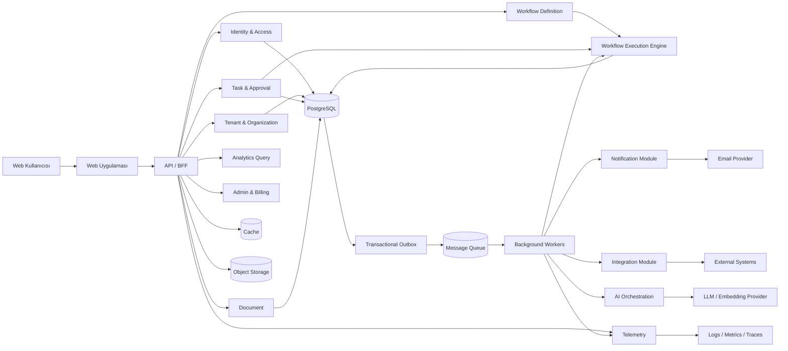
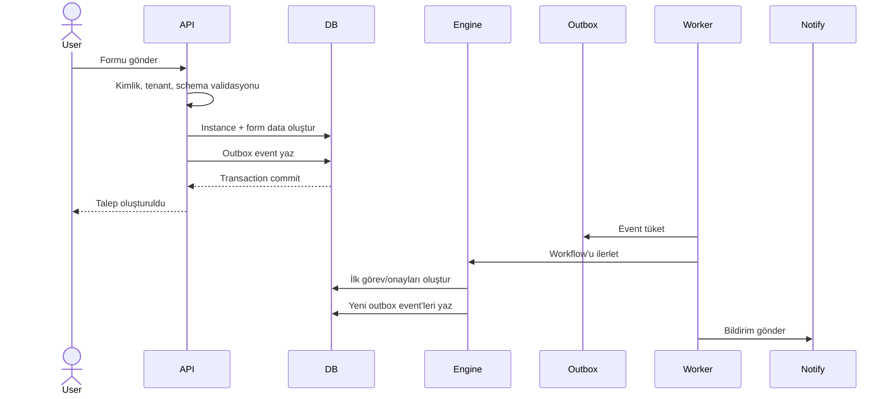
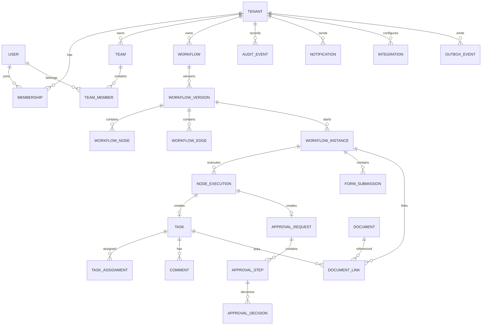
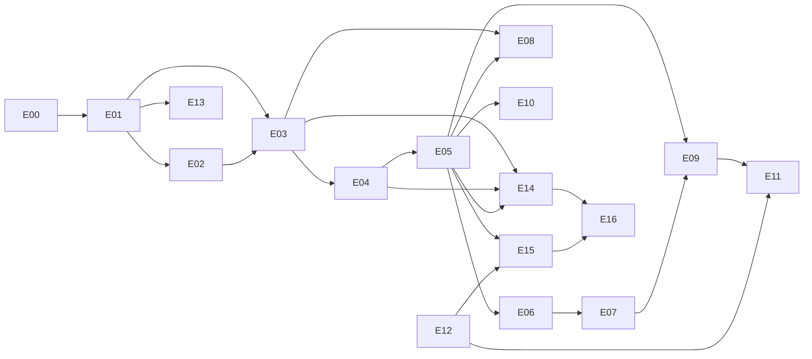

# FlowPilot — Teknik Ürün Gereksinimleri Dokümanı (Technical PRD)

> **Doküman sürümü:** 0.2 — Agent-Ready Edition  
> **Tarih:** 14 Temmuz 2026  
> **Durum:** Araştırma, mimari yönetişim ve otonom geliştirme girdisi  
> **Ürün sahibi:** Nisa Nur Altay  
> **Doküman amacı:** FlowPilot ürününün kapsamını, işlevsel gereksinimlerini, teknik mimarisini, veri modelini, güvenlik yaklaşımını, yapay zekâ özelliklerini ve MVP sınırlarını teknoloji seçiminden önce netleştirmek; ayrıca bir AI coding agent tarafından epic, story, task, test ve pull request üretiminde kullanılabilecek normatif geliştirme sözleşmesini tanımlamak.

---

## 1. Yönetici Özeti

FlowPilot; küçük ve orta ölçekli işletmelerin dağınık e-posta, mesajlaşma, elektronik tablo ve sözlü takip üzerinden yürüttüğü görev, talep, onay ve departmanlar arası iş akışlarını merkezi bir platformda tanımlamasını, çalıştırmasını ve izlemesini sağlayan çok kiracılı (multi-tenant) bir SaaS ürünüdür.

Ürün yalnızca bir görev yönetim aracı olarak konumlandırılmamalıdır. FlowPilot’ın ana değeri:

1. İş süreçlerini görsel veya yapılandırılmış bir iş akışı olarak tanımlamak,
2. Formlardan gelen talepleri kurallara göre yönlendirmek,
3. Sıralı, paralel ve koşullu onay süreçlerini yürütmek,
4. Görevleri doğru kişi, ekip veya role otomatik atamak,
5. Gecikmeleri, SLA ihlallerini ve darboğazları görünür hâle getirmek,
6. Her kritik işlemi denetlenebilir bir kayıt altında tutmak,
7. Yapay zekâyı karar verici değil, süreçleri hızlandıran kontrollü bir yardımcı olarak kullanmak

olmalıdır.

İlk ürün sürümü için önerilen mimari, **modüler monolit + arka plan işçileri + olay tabanlı entegrasyon** yaklaşımıdır. Mikroservis mimarisi ilk aşamada tercih edilmemelidir. Süreç yürütme, bildirim, zamanlayıcı, entegrasyon ve yapay zekâ işleri arka plan işçileri tarafından çalıştırılmalı; kullanıcı işlemleri ile asenkron işler arasında güvenilirlik için transactional outbox kullanılmalıdır.

İlk hedef müşteri profili bir ürün varsayımı olarak:

- 20–250 çalışanlı,
- iş süreçleri e-posta, WhatsApp, Excel veya Google Sheets üzerinde parçalanmış,
- satın alma, izin, masraf, içerik onayı, müşteri operasyonu veya çalışan onboarding süreçlerinde görünürlük problemi yaşayan,
- özel kurumsal BPM ürünlerini pahalı veya karmaşık bulan

Türkiye merkezli KOBİ’lerdir.

Bu müşteri profili kullanıcı görüşmeleriyle doğrulanmadan kesin kabul edilmemelidir.

---

## 2. Araştırma Özeti

### 2.1 Pazarın ortak ürün desenleri

Güncel iş akışı ve iş yönetimi ürünlerinde ortaklaşan yetenekler şunlardır:

- Form üzerinden yapılandırılmış talep toplama
- Görsel iş akışı oluşturma
- Koşullu dallanma
- Sıralı ve paralel onaylar
- SLA, gecikme, hatırlatma ve eskalasyon
- Rol veya kişiye otomatik atama
- Hazır süreç şablonları
- Entegrasyonlar ve webhook’lar
- Gerçek zamanlı süreç görünürlüğü
- Denetim izi ve işlem geçmişi
- Yapay zekâ ile özetleme, sınıflandırma ve süreç oluşturma

monday.com, basit otomasyonlar ile çok adımlı ve koşullu süreçler için ayrı bir görsel workflow builder yaklaşımı kullanmaktadır. Form yanıtları doğrudan çalışma alanında kayıt hâline getirilebilmektedir. [R1][R2]

Kissflow; koşullu yönlendirme, sıralı/paralel onay, SLA, yedek onaycı, yeniden atama ve denetim kaydı gibi onay motoru özelliklerini birlikte sunmaktadır. Bu, FlowPilot onay modelinin yalnızca “onayla/reddet” düğmesinden ibaret olmaması gerektiğini göstermektedir. [R3]

Process Street, onay süreçlerinde uyumluluk, kalite kontrolü ve denetim izini güçlü bir ürün bileşeni olarak öne çıkarmaktadır. [R4]

Pipefy, yapılandırılmış talep toplama ile AI destekli bağlam anlama ve onay süreci başlatmayı birleştirmektedir. [R5]

Asana AI Studio, yapay zekâyı ayrı bir sohbet ekranı yerine doğrudan iş akışlarının içine yerleştirmektedir. Bu desen FlowPilot için de önemlidir: AI özellikleri ürünün ana iş akışından kopuk olmamalıdır. [R6]

BPMN, iş süreçlerinin iş birimleri ve teknik ekipler tarafından ortak biçimde anlaşılabilmesi için de-facto standarttır. FlowPilot’ın MVP görsel dili BPMN’in tamamını uygulamak zorunda değildir; ancak temel düğüm ve akış semantiği BPMN kavramlarıyla uyumlu tasarlanmalıdır. [R7]

### 2.2 Rekabet çıkarımı

Pazar “görev yönetimi” tarafında oldukça kalabalıktır. Bu nedenle FlowPilot’ın farklılaşması aşağıdaki eksende kurulmalıdır:

> **Görevleri listeleyen bir uygulama değil; talepleri kurala göre yöneten, onayları yürüten, departmanlar arası handoff’ları otomatikleştiren ve tüm süreci denetlenebilir yapan operasyon platformu.**

### 2.3 Önerilen stratejik farklılaştırıcılar

1. **Türkçe ve KOBİ odaklı kurulum deneyimi**  
   Satın alma talebi, izin talebi, masraf onayı, çalışan onboarding’i ve içerik onayı gibi hazır Türkçe şablonlar.

2. **Basitlik katmanı**  
   BPM sistemlerindeki ağır terminoloji yerine anlaşılır düğümler: Başlangıç, Form, Görev, Onay, Koşul, Bekle, Bildirim, Webhook, Bitiş.

3. **Şeffaf onay motoru**  
   Kullanıcı, talebin neden belirli yöneticiye yönlendirildiğini görebilmeli:  
   “Tutar 50.000 TL’den büyük olduğu için Finans Müdürü onayı eklendi.”

4. **Denetlenebilir yapay zekâ**  
   AI tarafından oluşturulan her özet veya öneri; kaynak, model, kullanıcı, tarih ve güven seviyesiyle kaydedilmeli.

5. **Hızlı değer üretimi**  
   Kullanıcının boş bir canvas ile başlaması yerine şablon seçip alanları uyarlaması hedeflenmeli.

6. **Operasyon zekâsı**  
   Sadece “kaç görev tamamlandı?” değil:
   - En çok hangi adım bekliyor?
   - Hangi onaycı darboğaz oluşturuyor?
   - Ortalama çevrim süresi nedir?
   - Hangi süreç en fazla yeniden işleme gerektiriyor?
   - SLA ihlali hangi departmanda yoğunlaşıyor?

---

## 3. Ürün Vizyonu

### 3.1 Vizyon cümlesi

FlowPilot, KOBİ’lerin kod yazmadan iş süreçlerini standartlaştırabildiği, çalıştırabildiği ve sürekli iyileştirebildiği akıllı operasyon platformudur.

### 3.2 Ürün vaadi

- Talepler kaybolmaz.
- Onaylar e-postada veya mesajlarda dağılmaz.
- Her işin sahibi ve mevcut durumu bellidir.
- Geciken adımlar otomatik takip edilir.
- Süreç değişiklikleri kontrollü ve versiyonlu yapılır.
- Yönetim, süreçlerin gerçek performansını görebilir.
- AI, bağlamdan kopuk cevap üretmek yerine süreç verisine dayanır.

### 3.3 Kuzey yıldızı metriği

**Aylık başarıyla tamamlanan aktif iş akışı örneği sayısı**  
(`Successfully completed workflow instances / month`)

Bu metrik yalnızca kullanıcı girişini değil, ürünün gerçek operasyonel değer üretmesini ölçer.

---

## 4. Problem Tanımı

KOBİ’lerde tekrarlanan operasyonel süreçler genellikle şu araçlarla yürütülür:

- E-posta zincirleri
- WhatsApp veya Slack mesajları
- Excel / Google Sheets
- Kağıt veya PDF formlar
- Sözlü onaylar
- Birbirinden kopuk görev yönetimi araçları

Bu yapı aşağıdaki problemlere yol açar:

- Talebin mevcut durumu bilinmez.
- Onay sırası manuel takip edilir.
- Gecikmeler geç fark edilir.
- Çalışan ayrıldığında süreç bilgisi kaybolur.
- Aynı işlem farklı kişiler tarafından farklı şekilde yürütülür.
- Yetkisiz kişiler hassas verilere erişebilir.
- Kimin, neyi, ne zaman onayladığı kanıtlanamaz.
- Yönetim süreç performansını ölçemez.
- Departmanlar arası teslimlerde sorumluluk boşluğu oluşur.
- Dokümanlar ve görevler birbirinden kopuk tutulur.

---

## 5. Hedef Kullanıcılar ve Personalar

### 5.1 Organizasyon sahibi / yönetici

**İhtiyaçları**
- Şirket genelindeki süreçleri görmek
- Geciken ve riskli işleri takip etmek
- Yetki ve onay limitlerini yönetmek
- Operasyon raporu almak

**Başarı kriteri**
- Bekleyen kritik onayları tek ekranda görebilmek
- Süreç çevrim süresinin düşmesi
- Manuel takip ihtiyacının azalması

### 5.2 Süreç sahibi

Örnek: İnsan Kaynakları Uzmanı, Finans Operasyon Sorumlusu, Satın Alma Uzmanı.

**İhtiyaçları**
- Form oluşturmak
- İş akışını tanımlamak
- Onay ve atama kuralları eklemek
- Süreci yayınlamak ve versiyonlamak
- Darboğazları analiz etmek

### 5.3 Çalışan / talep sahibi

**İhtiyaçları**
- Kolay talep oluşturmak
- Talebin hangi aşamada olduğunu görmek
- Eksik bilgi istenirse tamamlamak
- Sonucu ve gerekçeyi öğrenmek

### 5.4 Onaycı

**İhtiyaçları**
- Bekleyen onayları önceliğe göre görmek
- Talebin tüm bağlamına erişmek
- Onay, ret veya değişiklik talebi vermek
- Vekâlet veya delege mekanizması kullanmak

### 5.5 Organizasyon yöneticisi

**İhtiyaçları**
- Kullanıcı, ekip, rol ve izinleri yönetmek
- Güvenlik politikalarını belirlemek
- Entegrasyonları ve veri saklama ayarlarını yönetmek
- Audit log incelemek

---

## 6. Jobs to Be Done

1. “Bir çalışan satın alma talebi açtığında, tutara ve departmana göre doğru kişilerin doğru sırada onay vermesini istiyorum.”
2. “Bir görev geciktiğinde manuel mesaj atmak yerine sistemin otomatik hatırlatma ve eskalasyon yapmasını istiyorum.”
3. “Bir süreç tamamlandığında sonraki departmana otomatik görev oluşturulmasını istiyorum.”
4. “Kimin hangi tarihte hangi kararı verdiğini kanıtlayabilmek istiyorum.”
5. “İş akışını değiştirdiğimde devam eden eski süreçlerin bozulmamasını istiyorum.”
6. “Haftalık olarak ekipte nelerin tamamlandığını ve nerelerde gecikme yaşandığını özet görmek istiyorum.”
7. “Şirket dokümanları hakkında soru sorulduğunda yalnızca yetkili olunan dokümanlardan cevap üretilmesini istiyorum.”
8. “Teknik bilgim olmadan hazır bir şablonu şirket kurallarıma uyarlamak istiyorum.”

---

## 7. Ürün Hedefleri

### 7.1 MVP hedefleri

- Kullanıcı ve organizasyon yönetimi
- Ekip ve rol tanımlama
- Form tabanlı talep oluşturma
- Basit görsel workflow builder
- Görev ve onay adımları
- Koşullu yönlendirme
- Sıralı onay
- Temel paralel onay
- Son tarih, hatırlatma ve eskalasyon
- Uygulama içi ve e-posta bildirimleri
- Workflow versiyonlama
- Çalışan süreç örneklerini izleme
- Audit log
- Temel operasyon dashboard’u
- Haftalık AI özeti
- Webhook çıkışı
- Üç hazır süreç şablonu

### 7.2 MVP dışı hedefler

Aşağıdaki özellikler ilk sürümde yapılmamalıdır:

- Tam BPMN 2.0 uyumluluğu
- Gelişmiş DMN karar tabloları
- Her müşteriye özel kod geliştirme
- Native mobil uygulama
- Marketplace
- Onlarca üçüncü taraf entegrasyon
- Otonom AI ajanlarının finansal veya hukuki karar vermesi
- Karmaşık süreç madenciliği
- Şirketler arası ortak workflow
- Çok bölgeli active-active altyapı
- Mikroservis mimarisi
- Gelişmiş elektronik imza altyapısının ürün içinde sıfırdan geliştirilmesi

---

## 8. İlk Kullanım Senaryoları

### 8.1 Satın alma talebi

1. Çalışan ürün/hizmet, tutar, gerekçe ve teklif dokümanını girer.
2. Sistem departman ve tutara göre akışı belirler.
3. 10.000 TL altı talepler ekip yöneticisine gider.
4. 10.000–50.000 TL arası talepler ekip yöneticisi ve finans onayına gider.
5. 50.000 TL üzeri talepler genel müdür onayına da gider.
6. Onay tamamlanınca satın alma ekibine görev atanır.
7. SLA aşılırsa onaycıya hatırlatma, sonra yöneticisine eskalasyon gönderilir.
8. Tüm kararlar audit log’a yazılır.

### 8.2 İzin talebi

1. Çalışan izin tarihlerini ve türünü seçer.
2. Sistem tarih aralığını doğrular.
3. Yönetici onayı ister.
4. Onaylanırsa İK’ya bildirim gönderir.
5. Takvim entegrasyonu sonraki fazda işlenir.

### 8.3 Çalışan onboarding’i

1. İK yeni çalışan kaydı açar.
2. Paralel olarak BT ekipman görevi, hesap açma görevi ve yönetici hazırlık görevi oluşturulur.
3. Tüm zorunlu adımlar bitmeden süreç tamamlanamaz.
4. Geciken görevler süreç sahibine gösterilir.
5. İlk gün tamamlanması gereken adımlar ayrı SLA ile izlenir.

### 8.4 İçerik / tasarım onayı

1. İçerik üreticisi dosya veya bağlantı yükler.
2. Editör değişiklik isteyebilir.
3. Revizyon sonrası yeniden onaya gönderilir.
4. Onaylanan versiyon kilitlenir.
5. Yayın ekibine görev atanır.

### 8.5 Müşteri operasyon talebi

1. Müşteri temsilcisi talep açar.
2. Talep türüne göre operasyon ekibine yönlendirilir.
3. Kritik taleplerde yönetici onayı veya öncelik yükseltme uygulanır.
4. SLA aşım riski dashboard’da gösterilir.

---

## 9. Fonksiyonel Gereksinimler

## 9.1 Organizasyon ve multi-tenancy

### Gereksinimler

- Her müşteri bir `tenant/organization` olarak temsil edilmelidir.
- Her kullanıcı bir veya birden fazla organizasyona üye olabilmelidir.
- Kullanıcının organizasyon içindeki rolü üyelik üzerinden belirlenmelidir.
- Tüm iş verileri `tenant_id` ile ilişkilendirilmelidir.
- Tenant sınırı hiçbir API, sorgu, arama, bildirim veya AI isteğinde aşılamamalıdır.
- Organizasyon sahibi, organizasyonu devredebilmeli veya kapatabilmelidir.
- Tenant silme işlemi anlık fiziksel silme yerine kontrollü yaşam döngüsüyle yürütülmelidir.
- Veri dışa aktarma desteği planlanmalıdır.

### Kabul kriterleri

- Bir tenant kullanıcısı başka tenant’a ait bir kaydın kimliğini tahmin ederek veriye erişemez.
- Yönetici rolü olmayan kullanıcı organizasyon ayarlarını değiştiremez.
- Aynı e-posta adresi farklı organizasyonlarda farklı rollerle yer alabilir.

---

## 9.2 Kimlik doğrulama ve üyelik

### MVP

- E-posta + şifre
- E-posta doğrulama
- Şifre sıfırlama
- Güvenli oturum yönetimi
- Organizasyona davet
- Davet süresi
- Üyelik durumu: `invited`, `active`, `suspended`, `removed`
- İsteğe bağlı MFA mimarisine hazır tasarım

### Sonraki faz

- Google / Microsoft OAuth
- SAML/OIDC SSO
- SCIM kullanıcı provizyonlama
- Zorunlu MFA politikası
- IP allowlist

---

## 9.3 Ekip, rol ve yetki yönetimi

### Sistem rolleri

- `organization_owner`
- `organization_admin`
- `workflow_admin`
- `manager`
- `member`
- `auditor`
- `guest`

### Yetki yaklaşımı

İlk sürüm RBAC kullanmalıdır. Ancak kaynak sahipliği, departman ve hassas veri gibi kontroller için ileride ABAC eklenebilecek şekilde policy katmanı ayrıştırılmalıdır.

Örnek izinler:

- `workflow.definition.create`
- `workflow.definition.publish`
- `workflow.instance.read`
- `workflow.instance.cancel`
- `task.assign`
- `approval.decide`
- `audit.read`
- `analytics.read`
- `integration.manage`
- `member.manage`

### Kurallar

- “Kendi oluşturduğu talebi okuma” gibi sahiplik kontrolleri desteklenmelidir.
- Onaycı, yalnızca kendisine veya rolüne atanmış onay üzerinde karar verebilmelidir.
- Workflow yayınlama yetkisi oluşturma yetkisinden ayrılmalıdır.
- Hassas alanlar alan seviyesinde gizlenebilmelidir.
- Tüm yetki reddi olayları güvenlik log’una yazılmalıdır.

---

## 9.4 Form oluşturucu

### Alan tipleri

- Kısa metin
- Uzun metin
- Sayı
- Para
- Tarih
- Tarih aralığı
- Saat
- Tek seçim
- Çoklu seçim
- Checkbox
- Kullanıcı seçimi
- Ekip seçimi
- Dosya yükleme
- Bağlantı
- E-posta
- Telefon
- Açıklama / başlık
- Hesaplanan alan (sonraki faz)

### Alan özellikleri

- Zorunlu / isteğe bağlı
- Varsayılan değer
- Açıklama
- Placeholder
- Min/max uzunluk
- Sayısal min/max
- Dosya tipi ve boyutu
- Görünürlük koşulu
- Düzenlenebilirlik koşulu
- Hassas alan etiketi
- Yalnızca belirli rollerin görebilmesi
- Form gönderimi sonrası kilitlenme
- Revizyon talebinde tekrar düzenlenebilme

### Form davranışı

- Form şeması workflow versiyonuyla birlikte değişmez biçimde saklanmalıdır.
- Yeni versiyonda alan silinirse eski workflow instance’larının verisi korunmalıdır.
- Sunucu tarafı validasyon zorunludur.
- Dosya yüklemeleri doğrudan uygulama sunucusu üzerinden taşınmamalı; güvenli pre-signed URL yaklaşımı kullanılmalıdır.
- Zararlı dosya taraması için entegrasyon noktası bulunmalıdır.

---

## 9.5 Workflow oluşturucu

### MVP düğüm tipleri

1. **Start**
2. **Form Submission**
3. **Human Task**
4. **Approval**
5. **Condition**
6. **Parallel Split**
7. **Parallel Join**
8. **Wait / Timer**
9. **Notification**
10. **Webhook / HTTP Action**
11. **Set Data**
12. **End**

### Sonraki faz düğümleri

- AI Classification
- AI Extraction
- Document Generation
- E-signature
- Sub-workflow
- External Event Wait
- Script / custom function
- DMN decision table
- Integration connector

### Builder gereksinimleri

- Sürükle-bırak canvas
- Düğüm özellik paneli
- Bağlantı doğrulama
- Başlangıçtan bitişe erişilebilirlik kontrolü
- Yetim düğüm uyarısı
- Sonsuz döngü uyarısı
- Yayın öncesi doğrulama
- Test çalıştırması
- Taslak kaydetme
- Otomatik kaydetme
- Değişiklik geçmişi
- Taslak kopyalama
- Şablondan oluşturma
- Okunabilir süreç özeti
- Akışın JSON temsili

### Tasarım ilkesi

MVP, BPMN’in tüm sembollerini sunmayacaktır. Kullanıcı deneyimi sade tutulacak, ancak aşağıdaki kavramlar korunacaktır:

- Aktivite
- Gateway / koşul
- Paralel ayrılma ve birleşme
- İnsan görevi
- Timer
- Event
- Bitiş durumu

---

## 9.6 Workflow versiyonlama

Workflow tanımı doğrudan üzerinde çalışan bir belge olmamalıdır.

### Durumlar

- `draft`
- `published`
- `deprecated`
- `archived`

### Kurallar

- Bir workflow yayınlandığında immutable bir `workflow_version` oluşturulmalıdır.
- Yeni düzenlemeler mevcut yayınlanmış versiyonu değiştirmemelidir.
- Her workflow instance başlatıldığı versiyona bağlı kalmalıdır.
- Yeni başlatılan instance’lar varsayılan olarak son yayınlanan versiyonu kullanmalıdır.
- Eski versiyonlar görüntülenebilmeli, ancak değiştirilememelidir.
- Yayınlama işlemi yetki ve audit gerektirir.
- Kritik değişikliklerde isteğe bağlı dört göz prensibi eklenebilmelidir.

---

## 9.7 Workflow execution engine

### Temel kavramlar

- **Definition:** Sürecin mantıksal şablonu
- **Version:** Yayınlanmış değişmez tanım
- **Instance:** Bir sürecin tek çalışması
- **Node instance:** Bir düğümün çalışma kaydı
- **Token:** Akışın hangi yollarda ilerlediğini temsil eden yürütme işareti
- **Human task:** Kullanıcı aksiyonu bekleyen iş
- **Timer:** Belirli zamana kadar bekleyen kayıt
- **Event:** Sistemde meydana gelen anlamlı durum değişikliği

### Instance durumları

- `pending`
- `running`
- `waiting`
- `completed`
- `rejected`
- `cancelled`
- `failed`
- `suspended`

### Teknik gereksinimler

- Aynı event birden fazla kez işlense bile sonuç değişmemelidir (idempotency).
- Dış servis çağrıları retry + exponential backoff kullanmalıdır.
- Kalıcı başarısızlıklar dead-letter veya incident kaydına düşmelidir.
- Timer’lar uygulama belleğinde tutulmamalıdır.
- Her node giriş ve çıkışı event olarak kaydedilmelidir.
- Execution state işlem sınırları içinde güncellenmelidir.
- Kullanıcı isteği tamamlanmadan uzun entegrasyon işleri yapılmamalıdır.
- Paralel branch’lerin tamamlanma koşulu açıkça tanımlanmalıdır.
- Workflow iptali, açık görevleri ve timer’ları kontrollü biçimde kapatmalıdır.
- Manuel retry, skip veya resolve gibi operasyon araçları yalnızca yetkili yöneticilere sunulmalıdır.
- Çalışma sırasında definition JSON yeniden yorumlanırken yayınlanmış versiyon hash’i doğrulanmalıdır.

### Dayanıklılık yaklaşımı

Uzun süre çalışan süreçlerde servis kesintisi sonrası kaldığı yerden devam etme temel gereksinimdir. Temporal bu problemi event history ve durable execution yaklaşımıyla çözerken, Camunda BPMN/DMN tabanlı süreç motoru sunmaktadır. FlowPilot için “özel motor”, “Temporal” ve “Camunda” seçenekleri teknoloji karar aşamasında karşılaştırılmalıdır. [R8][R9]

---

## 9.8 Görev yönetimi

### Görev alanları

- Başlık
- Açıklama
- Workflow instance
- Node instance
- Atanan kullanıcı
- Atanan ekip veya rol
- Öncelik
- Durum
- Oluşturulma tarihi
- Başlangıç tarihi
- Son tarih
- Tamamlanma tarihi
- SLA hedefi
- Etiketler
- Ekler
- Yorumlar
- Checklist
- Bağımlılıklar
- Form bağlamı

### Görev durumları

- `open`
- `in_progress`
- `blocked`
- `waiting`
- `completed`
- `cancelled`
- `overdue`

### Atama stratejileri

- Belirli kullanıcı
- Belirli rol
- Belirli ekip
- Talep sahibinin yöneticisi
- Form alanından seçilen kullanıcı
- Round-robin
- En az iş yükü olan kişi (sonraki faz)
- Dinamik expression sonucu

---

## 9.9 Onay motoru

### Onay modelleri

- Tek onaycı
- Sıralı çoklu onay
- Paralel çoklu onay
- Herkes onaylamalı
- En az bir kişi onaylamalı
- Quorum / N kişiden M onay
- Rol bazlı onay
- Tutar limitine göre onay
- Departmana göre onay
- Koşula göre onaycı ekleme
- Yedek onaycı
- Vekâlet / delegation
- Eskalasyon
- Yeniden onaya gönderme

### Kararlar

- `approved`
- `rejected`
- `changes_requested`
- `abstained` (sonraki faz)
- `expired`
- `delegated`

### Gereksinimler

- Ret gerekçesi zorunlu yapılabilmelidir.
- Değişiklik talebi, talep sahibine düzenleme görevi oluşturmalıdır.
- Onay sonrasında kritik form alanlarının değiştirilmesi önceki onayı geçersiz kılabilmelidir.
- Karar tarihi, karar veren, vekâlet bilgisi ve açıklama değişmez biçimde kaydedilmelidir.
- Onaycı kendi onay adımını başkasının hesabıyla tamamlayamamalıdır.
- Toplu onay sadece açıkça izin verilen süreçlerde bulunmalıdır.
- Riskli veya finansal süreçlerde “talep sahibi kendi talebini onaylayamaz” kuralı desteklenmelidir.
- Onay ekranı kararın etkisini göstermelidir.
- E-posta üzerinden tek tık onay MVP dışı tutulmalıdır; token güvenliği nedeniyle sonraki fazda tasarlanmalıdır.

---

## 9.10 Koşul ve kural motoru

### MVP koşul operatörleri

- Eşittir / eşit değildir
- Büyüktür / küçüktür
- Büyük eşittir / küçük eşittir
- İçerir / içermez
- Boş / boş değil
- Listede
- Tarihten önce / sonra
- Kullanıcı rolü
- Departman
- AND / OR gruplama

### Kural tasarımı

Kullanıcının yazdığı serbest JavaScript veya Python kodu doğrudan çalıştırılmamalıdır.

Önerilen yaklaşım:

- Güvenli bir expression DSL
- Whitelist edilmiş fonksiyonlar
- Tip kontrollü alan referansları
- Sunucu tarafı parser
- Maksimum expression karmaşıklığı
- Evaluation timeout
- Deterministik sonuç
- Test örneği çalıştırma

Örnek ifade:

```text
request.amount > 50000
AND requester.department == "Marketing"
AND request.category IN ["Software", "Consulting"]
```

---

## 9.11 SLA, timer ve eskalasyon

### Gereksinimler

- Node bazlı son tarih
- İş günü bazlı süre
- Takvim günü bazlı süre
- Çalışma saatleri
- Organizasyon tatil takvimi (sonraki faz)
- Deadline öncesi hatırlatma
- Deadline sonrası uyarı
- Birden fazla eskalasyon seviyesi
- Yedek atama
- Süre durdurma koşulu
- Bekleme süresini raporlama
- SLA ihlal nedeni

### Örnek

- Onay için 24 saat
- 18. saatte hatırlatma
- 24. saatte overdue
- 30. saatte onaycının yöneticisine eskalasyon
- 48. saatte yedek onaycıya yeniden atama

---

## 9.12 Bildirim sistemi

### Kanallar

#### MVP
- Uygulama içi
- E-posta

#### Sonraki faz
- Slack
- Microsoft Teams
- Mobil push
- SMS
- WhatsApp Business

### Bildirim türleri

- Görev atandı
- Onay bekliyor
- Değişiklik istendi
- Talep onaylandı/reddedildi
- Son tarih yaklaşıyor
- Görev gecikti
- Eskalasyon oluştu
- Workflow tamamlandı
- Entegrasyon başarısız
- Haftalık özet

### Gereksinimler

- Şablon tabanlı bildirim
- Organizasyon dili
- Kullanıcı tercihleri
- Bildirim sıklığı
- Aynı olay için duplicate önleme
- Digest desteği
- Retry
- Delivery status
- E-posta provider webhook’ları
- Hassas verinin e-posta gövdesinde gereksiz gösterilmemesi
- Unsubscribe kuralları; zorunlu güvenlik bildirimleri hariç

---

## 9.13 Yorum, aktivite ve iş birliği

- Görev ve talep üzerinde yorum
- Kullanıcı mention
- Dosya eki
- Aktivite akışı
- Sistem aksiyonlarının insan yorumlarından ayrılması
- Yorum düzenleme geçmişi
- Yorum silme politikasının audit ile izlenmesi
- Dahili not / talep sahibine görünür not ayrımı (sonraki faz)

---

## 9.14 Doküman yönetimi

### MVP

- Dosya yükleme
- Workflow ve görevle ilişkilendirme
- Yetki kontrollü indirme
- Dosya metadata
- Versiyon bilgisi
- Dosya boyutu ve türü sınırı
- Zararlı içerik tarama entegrasyon noktası
- Soft delete
- Saklama politikası altyapısı

### Sonraki faz

- Doküman versiyon karşılaştırma
- OCR
- E-imza entegrasyonu
- Belge sınıflandırma
- Şablondan belge oluşturma
- AI doküman sorgulama

---

## 9.15 Arama

### MVP

- Görev başlığı
- Workflow adı
- Talep numarası
- Talep sahibi
- Durum
- Tarih
- Etiket
- Onaycı
- Form alanlarının whitelist edilmiş bölümü

### Güvenlik

- Arama index’i tenant ve yetki sınırlarını korumalıdır.
- Hassas alanlar varsayılan olarak index’lenmemelidir.
- AI retrieval katmanı normal uygulama yetkilendirmesini atlamamalıdır.

---

## 9.16 Dashboard ve analitik

### Operasyon dashboard’u

- Aktif workflow instance sayısı
- Tamamlanan süreçler
- Bekleyen görevler
- Bekleyen onaylar
- Geciken görevler
- SLA ihlalleri
- Ortalama çevrim süresi
- Adım bazında bekleme süresi
- Onay ret oranı
- En çok revizyona dönen süreçler
- Kullanıcı/ekip iş yükü
- Süreç başına tamamlanma oranı

### Yönetim dashboard’u

- Departman bazında hacim
- Zaman içinde trend
- Kritik darboğazlar
- Süreç varyasyonları
- Otomasyonla kazanılan tahmini zaman
- Entegrasyon hata oranı
- AI kullanım ve maliyet metriği

### Analitik ilkeleri

- Operasyonel tablo doğrudan ağır analitik sorgularla yavaşlatılmamalıdır.
- MVP’de özet tablolar/materialized view kullanılabilir.
- İleride analitik store ayrılabilir.
- KPI tanımları sürümlenmeli ve açıklanmalıdır.

---

## 9.17 Şablon sistemi

### MVP şablonları

1. Satın alma talebi ve bütçe onayı
2. İzin talebi
3. Çalışan onboarding’i

### Sonraki şablonlar

- Masraf onayı
- İçerik onayı
- Sözleşme inceleme
- BT erişim talebi
- Müşteri şikâyeti
- Tedarikçi onboarding’i
- Kampanya onayı
- Ekipman talebi

### Şablon gereksinimleri

- Workflow tanımı
- Form şeması
- Rol önerileri
- SLA önerileri
- Örnek koşullar
- Kullanım açıklaması
- Demo veri
- Şablondan kopyalanınca bağımsız taslak oluşturma

---

## 9.18 Entegrasyon ve webhook

### MVP

- Outbound webhook
- API key
- Webhook secret
- HMAC imzası
- Retry
- Teslimat log’u
- Manuel tekrar gönderme
- Event filtreleme
- Rate limit

### Sonraki faz

- Slack
- Microsoft Teams
- Google Workspace
- Microsoft 365
- Jira
- GitHub
- HubSpot
- Logo / Mikro / Paraşüt
- ERP ve muhasebe sistemleri
- Zapier / Make / n8n

### Webhook güvenliği

- HTTPS zorunlu
- İmzalı payload
- Timestamp
- Replay attack koruması
- IP bilgisi
- Secret rotation
- SSRF koruması
- Domain allowlist seçeneği
- Maksimum cevap süresi
- Hassas alanların payload’dan çıkarılması

---

## 9.19 Audit log

Audit log FlowPilot’ın temel ürün bileşenidir.

### Kaydedilecek olaylar

- Giriş ve başarısız giriş
- Davet ve üyelik değişimi
- Rol ve izin değişimi
- Workflow oluşturma
- Workflow yayınlama
- Workflow arşivleme
- Instance başlatma
- Görev atama / yeniden atama
- Görev tamamlama
- Onay kararı
- Form verisi değişikliği
- Dosya yükleme / indirme / silme
- Entegrasyon değişikliği
- API key oluşturma / iptal
- AI sorgusu ve AI çıktısı
- Veri dışa aktarma
- Yönetici müdahalesi
- Incident çözümü

### Audit alanları

- `event_id`
- `tenant_id`
- `actor_type`
- `actor_id`
- `action`
- `resource_type`
- `resource_id`
- `timestamp`
- `ip_address`
- `user_agent`
- `request_id`
- `before_hash`
- `after_hash`
- `metadata`
- `reason`
- `impersonation_context`

### Kurallar

- Audit kayıtları normal uygulama güncelleme işlemleriyle değiştirilememelidir.
- Silme yerine saklama politikası uygulanmalıdır.
- Hassas değerlerin tamamı log’a yazılmamalıdır.
- Yönetici aksiyonları özellikle görünür olmalıdır.
- Export işlemleri ayrıca kaydedilmelidir.

OWASP, yüksek değerli işlemler için bütünlük kontrollü audit trail ve güvenlik olaylarının izlenmesini önermektedir. [R12][R13]

---

## 10. Yapay Zekâ Gereksinimleri

## 10.1 AI ürün ilkesi

AI, FlowPilot’ın süreç motorunun yerine geçmemelidir.

**Deterministik kurallar**:
- Kim onaylayacak?
- Tutar limiti aşıldı mı?
- Görev tamamlandı mı?
- SLA ihlal edildi mi?
- Workflow hangi adıma geçecek?

**AI destekli işlemler**:
- Metin özetleme
- Dokümandan alan çıkarma
- Talep sınıflandırma önerisi
- Haftalık rapor
- Darboğaz açıklaması
- Doğal dilden workflow taslağı
- Kurumsal doküman sorgulama

Kritik finansal, hukuki veya insan kaynakları kararları AI tarafından tek başına verilmemelidir.

## 10.2 MVP AI özellikleri

### Haftalık operasyon özeti

Girdi:
- Tamamlanan süreçler
- Bekleyen kritik görevler
- SLA ihlalleri
- En uzun bekleyen onaylar
- Ekip bazlı hacim

Çıktı:
- Yönetici özeti
- Riskler
- Önerilen takip maddeleri
- Kaynak metrik bağlantıları

### Süreç özeti

Bir workflow instance için:
- Talep neydi?
- Hangi kararlar verildi?
- Nerede bekledi?
- Şu an kimin aksiyonu gerekiyor?
- Kritik dosyalar hangileri?

### Doğal dilden workflow taslağı

Kullanıcı:
> “10 bin TL altındaki satın almaları müdür, üzerindekileri müdür ve finans onaylasın.”

AI:
- Form alanlarını önerir
- Koşul ve onay düğümleri oluşturur
- Taslak üretir
- Kullanıcı yayınlamadan önce doğrulama ekranı gösterir

AI hiçbir taslağı otomatik yayınlamamalıdır.

## 10.3 Doküman sorgulama / RAG

### Gereksinimler

- Tenant izolasyonu
- Doküman bazlı yetki
- Chunk seviyesinde erişim metadata’sı
- Kaynak gösterimi
- Cevap bulunamazsa açıkça belirtme
- Prompt injection savunması
- Dosya içindeki talimatları sistem talimatı gibi uygulamama
- Hassas veri maskeleme
- Model sağlayıcısına gönderilen verinin kayıt altına alınması
- Müşteri tercihine göre AI özelliğini kapatma
- Veri saklamayan model endpoint seçenekleri
- Embedding ve retrieval audit’i
- Cevap kalitesi değerlendirme seti

## 10.4 AI güvenlik kontrolleri

- İnsan onayı gerektiren aksiyon listesi
- Model çıktısı şema doğrulaması
- Maksimum token ve maliyet limiti
- Tenant bazlı kullanım kotası
- PII redaction
- Prompt ve completion log politikasının ayrı yönetimi
- Zararlı içerik filtresi
- Tool allowlist
- Harici URL erişiminin kapalı olması
- Model versiyonu kaydı
- Confidence yerine doğrulanabilir kaynak kullanımı
- Offline eval set
- Hallucination rate takibi
- AI özelliği başarısız olduğunda ana workflow’un çalışmaya devam etmesi

NIST AI RMF yaklaşımı, AI risklerini yönetim, bağlamlandırma, ölçme ve yönetme işlevleri üzerinden ele almaktadır. FlowPilot AI modülü bu çerçeveye uyarlanmalıdır. [R14]

---

## 11. Önerilen Sistem Mimarisi

## 11.1 Mimari karar

### İlk sürüm

**Modüler monolit + worker süreçleri + queue + PostgreSQL**

### Neden mikroservis değil?

- Ürün sınırları henüz değişebilir.
- Küçük ekipte dağıtık sistem operasyon maliyeti yüksektir.
- Transaction yönetimi zorlaşır.
- İzleme ve hata ayıklama karmaşıklaşır.
- Erken aşamada servis sınırları yanlış seçilebilir.
- MVP’de ölçekten çok ürün doğrulaması önemlidir.

### Mikroservise ayrılabilecek gelecekteki modüller

- Notification service
- Integration service
- AI service
- Analytics pipeline
- Workflow execution workers
- File processing
- Search indexing

---

## 11.2 Mantıksal mimari



---

## 11.3 Modül sınırları

### Identity & Access

- Authentication
- Session/token
- MFA hazırlığı
- Authorization policy
- API keys

### Tenant & Organization

- Organizations
- Memberships
- Teams
- Roles
- Departments
- Manager hierarchy

### Workflow Definition

- Workflow
- Version
- Nodes/edges
- Validation
- Templates
- Publishing

### Workflow Execution

- Instance
- Node execution
- State transition
- Timer
- Retry
- Incident
- Cancellation

### Task & Approval

- Human tasks
- Assignments
- Approvals
- Delegation
- SLA
- Comments

### Notification

- Templates
- Preferences
- In-app notifications
- Email
- Delivery tracking

### Integration

- Webhooks
- API credentials
- Connector configuration
- External action execution

### Document

- Metadata
- Upload authorization
- Access control
- Version
- Retention

### AI Orchestration

- Prompt templates
- Provider abstraction
- Retrieval
- Usage/maliyet
- Safety policy
- Evaluation

### Audit

- Immutable event trail
- Security events
- Export

### Analytics

- Operational metrics
- Aggregations
- Dashboard queries

---

## 11.4 Veri akışı: form gönderimi



---

## 11.5 Transactional outbox

Uygulama verisi güncellenip event yayınlanamadığında oluşabilecek tutarsızlığı önlemek için:

1. İş verisi ve outbox kaydı aynı DB transaction’ında yazılır.
2. Worker outbox tablosunu güvenilir şekilde okur.
3. Event message broker’a veya ilgili handler’a gönderilir.
4. İşlenen kayıt işaretlenir.
5. Handler’lar idempotent olur.

Bu yapı, ilk aşamada Kafka gerektirmeden güvenilir event-driven davranış sağlar.

---

## 11.6 Event formatı

CloudEvents yaklaşımı ortak event metadata standardı için referans alınabilir. [R10]

Örnek:

```json
{
  "specversion": "1.0",
  "id": "evt_01J...",
  "source": "/tenants/tenant_123/workflows",
  "type": "com.flowpilot.workflow.instance.started.v1",
  "subject": "workflow-instance/wi_456",
  "time": "2026-07-14T17:30:00Z",
  "datacontenttype": "application/json",
  "tenantid": "tenant_123",
  "correlationid": "req_789",
  "data": {
    "workflowId": "wf_1",
    "workflowVersion": 3,
    "instanceId": "wi_456",
    "startedBy": "user_9"
  }
}
```

---

## 12. Workflow Tanım Modeli

Örnek kavramsal JSON:

```json
{
  "schemaVersion": "1.0",
  "workflowId": "purchase_request",
  "version": 3,
  "startNodeId": "start_1",
  "nodes": [
    {
      "id": "start_1",
      "type": "form_start",
      "config": {
        "formSchemaId": "purchase_form_v3"
      }
    },
    {
      "id": "condition_1",
      "type": "condition",
      "config": {
        "branches": [
          {
            "name": "high_value",
            "expression": "request.amount > 50000",
            "target": "manager_approval"
          },
          {
            "name": "standard",
            "expression": "request.amount <= 50000",
            "target": "team_lead_approval"
          }
        ]
      }
    },
    {
      "id": "manager_approval",
      "type": "approval",
      "config": {
        "mode": "sequential",
        "approvers": [
          {"type": "requester_manager"},
          {"type": "role", "role": "finance_manager"}
        ],
        "sla": "PT24H",
        "onReject": "end_rejected"
      }
    }
  ],
  "edges": [
    {"from": "start_1", "to": "condition_1"}
  ]
}
```

### Kurallar

- Definition schema versiyonlanmalıdır.
- JSON doğrudan istemciden güvenilmeden doğrulanmalıdır.
- Node config her node türü için ayrı schema ile kontrol edilmelidir.
- Bilinmeyen node türü yayınlanamamalıdır.
- Yayınlanan içerik hash’lenmelidir.
- Definition migration aracı planlanmalıdır.

---

## 13. Temel Veri Modeli



### Önemli tablolar

- `tenants`
- `users`
- `memberships`
- `teams`
- `team_members`
- `roles`
- `role_permissions`
- `workflows`
- `workflow_versions`
- `workflow_nodes`
- `workflow_edges`
- `workflow_instances`
- `node_executions`
- `form_schemas`
- `form_submissions`
- `tasks`
- `task_assignments`
- `approval_requests`
- `approval_steps`
- `approval_decisions`
- `comments`
- `documents`
- `document_links`
- `timers`
- `notifications`
- `notification_deliveries`
- `integrations`
- `webhook_endpoints`
- `webhook_deliveries`
- `audit_events`
- `outbox_events`
- `idempotency_keys`
- `incidents`
- `ai_runs`
- `usage_records`

### Tenant izolasyonu

Her tenant verisi uygulama katmanında filtrelenmeli; ek savunma olarak PostgreSQL Row Level Security değerlendirilmelidir. PostgreSQL RLS, komut ve role göre satır güvenliği politikaları tanımlamaya izin verir. [R15]

---

## 14. API Tasarımı

### İlkeler

- REST-first
- OpenAPI sözleşmesi
- `/v1` versiyonlama
- UUID/ULID tabanlı public identifier
- Cursor pagination
- Idempotency key
- Problem Details benzeri standart hata formatı
- Correlation/request ID
- Tenant context
- Rate limiting
- Field-level authorization
- Optimistic concurrency
- ETag veya version alanı
- API inventory

### Örnek endpoint’ler

```text
POST   /v1/auth/login
POST   /v1/organizations
POST   /v1/organizations/{orgId}/invites
GET    /v1/organizations/{orgId}/members

POST   /v1/workflows
GET    /v1/workflows
GET    /v1/workflows/{workflowId}
POST   /v1/workflows/{workflowId}/drafts
POST   /v1/workflows/{workflowId}/validate
POST   /v1/workflows/{workflowId}/publish

POST   /v1/workflows/{workflowId}/instances
GET    /v1/workflow-instances
GET    /v1/workflow-instances/{instanceId}
POST   /v1/workflow-instances/{instanceId}/cancel
POST   /v1/workflow-instances/{instanceId}/suspend
POST   /v1/workflow-instances/{instanceId}/resume

GET    /v1/tasks
GET    /v1/tasks/{taskId}
POST   /v1/tasks/{taskId}/start
POST   /v1/tasks/{taskId}/complete
POST   /v1/tasks/{taskId}/reassign

GET    /v1/approvals
POST   /v1/approval-steps/{stepId}/decisions

POST   /v1/documents/upload-url
POST   /v1/documents/{documentId}/complete-upload

GET    /v1/audit-events
GET    /v1/analytics/operations
POST   /v1/webhooks
GET    /v1/webhook-deliveries
```

### Hata formatı

```json
{
  "type": "https://errors.flowpilot.dev/validation-error",
  "title": "Validation failed",
  "status": 422,
  "code": "WORKFLOW_INVALID",
  "requestId": "req_01J...",
  "errors": [
    {
      "path": "nodes.approval_1.config.approvers",
      "message": "En az bir onaycı gereklidir."
    }
  ]
}
```

---

## 15. Olay Kataloğu

- `workflow.definition.created.v1`
- `workflow.definition.published.v1`
- `workflow.instance.started.v1`
- `workflow.instance.completed.v1`
- `workflow.instance.cancelled.v1`
- `workflow.node.entered.v1`
- `workflow.node.completed.v1`
- `task.created.v1`
- `task.assigned.v1`
- `task.completed.v1`
- `task.overdue.v1`
- `approval.requested.v1`
- `approval.decided.v1`
- `approval.escalated.v1`
- `form.submitted.v1`
- `document.uploaded.v1`
- `notification.requested.v1`
- `notification.delivered.v1`
- `notification.failed.v1`
- `webhook.delivery.failed.v1`
- `integration.action.failed.v1`
- `ai.run.completed.v1`
- `ai.run.failed.v1`
- `security.authorization.denied.v1`

Her event için:

- Sahip modül
- Schema
- PII sınıfı
- Retention
- Consumer listesi
- Retry davranışı
- Versiyonlama kuralı

tanımlanmalıdır.

---

## 16. Güvenlik Gereksinimleri

## 16.1 Güvenlik standardı

- OWASP ASVS, güvenlik gereksinimleri ve doğrulama kontrol listesi için temel alınmalıdır. [R12]
- API güvenliği, OWASP API Security Top 10 riskleri dikkate alınarak tasarlanmalıdır. Özellikle object-level authorization, authentication, property-level authorization, resource consumption ve function-level authorization FlowPilot için kritiktir. [R11]
- Güvenlik testleri CI/CD quality gate olmalıdır.

## 16.2 Temel kontroller

- TLS
- Güvenli parola hash algoritması
- Short-lived access token veya güvenli server session
- Refresh token rotation
- CSRF koruması
- Secure/HttpOnly/SameSite cookie
- Rate limit
- Brute-force koruması
- Session revocation
- Device/session listesi
- Input validation
- Output encoding
- ORM yanında sorgu güvenliği
- Dosya türü doğrulama
- Secret manager
- Encryption at rest
- Backup encryption
- Key rotation
- Least privilege
- Environment separation
- Dependency scanning
- SAST
- DAST
- Container image scanning
- IaC scanning
- Audit logging
- Incident response plan

## 16.3 FlowPilot’a özgü tehditler

### Tenant veri sızıntısı

Kontroller:
- Her repository çağrısında tenant scope
- RLS değerlendirmesi
- Cross-tenant test suite
- Cache key içinde tenant
- Search index filtresi
- Object storage path izolasyonu

### Yetkisiz onay

Kontroller:
- Approval step ownership kontrolü
- Step state kontrolü
- Replay önleme
- MFA gerektiren kritik onay seçeneği
- Decision nonce/idempotency
- Audit trail

### Workflow manipülasyonu

Kontroller:
- Published version immutable
- Hash
- Publish permission
- Change diff
- Dört göz prensibi seçeneği

### SSRF

Kontroller:
- Outbound webhook URL doğrulama
- Private IP bloklama
- DNS rebinding savunması
- Redirect sınırı
- Egress proxy
- Allowlist

### Notification abuse / maliyet saldırısı

Kontroller:
- Tenant quota
- Rate limit
- Duplicate suppression
- Provider budget alert
- Bulk action limit

### AI prompt injection

Kontroller:
- Doküman içeriği ile sistem talimatını ayırma
- Tool kullanımını kısıtlama
- Kaynak izin kontrolü
- Çıktı schema doğrulama
- Harici çağrıları kapatma
- Human-in-the-loop

---

## 17. Gizlilik ve Veri Koruma

FlowPilot, çalışan verileri, onay geçmişi, organizasyon yapısı, dokümanlar ve operasyonel metrikler gibi kişisel veya kurumsal hassas veriler işleyecektir.

KVKK rehberi, kişisel verilerin hukuka aykırı işlenmesini ve erişimini önlemek ile verilerin muhafazasını sağlamak için teknik ve idari tedbirler alınmasını öngörmektedir. [R16]

Avrupa Komisyonu’nun privacy by design/default yaklaşımına göre veri koruma ürün tasarımının erken aşamasında ele alınmalı; varsayılan olarak yalnızca gerekli veri işlenmeli, erişim sınırlandırılmalı ve saklama süreleri kontrollü tutulmalıdır. [R17]

### Ürün gereksinimleri

- Veri envanteri
- Veri sınıflandırması
- Tenant bazlı saklama politikası
- Silme ve anonimleştirme
- Kullanıcı verisi dışa aktarma
- Erişim log’u
- Alt işleyen/provider envanteri
- Bölgesel veri barındırma seçeneği için mimari hazırlık
- AI provider veri işleme ayarı
- Gereksiz PII toplamama
- Hassas alan işaretleme
- Varsayılan minimum görünürlük
- Backup retention ile silme politikasının uyumu
- Hukuki metinler ve sözleşmeler için uzman incelemesi

> Bu bölüm hukuki görüş değildir. Ürün piyasaya çıkmadan önce KVKK/GDPR yükümlülükleri uzman hukuk danışmanı tarafından doğrulanmalıdır.

---

## 18. Non-Functional Requirements

## 18.1 Performans hedefleri

MVP hedefleri:

- Standart read API p95: `< 400 ms`
- Standart write API p95: `< 700 ms`
- Dashboard ilk yükleme p95: `< 2.5 s`
- Form gönderimi kullanıcı yanıtı: `< 1 s` hedef; asenkron işler sonradan
- Workflow ilk node oluşturma: `< 5 s`
- Bildirim enqueue: `< 5 s`
- Basit arama: `< 1 s`
- Builder otomatik kayıt: kullanıcı deneyimini kesmeyecek şekilde

Bu hedefler gerçek yük testleriyle güncellenmelidir.

## 18.2 Kullanılabilirlik

- MVP aylık kullanılabilirlik hedefi: `%99.5`
- Planlı bakım bildirimi
- Health/readiness endpoint
- Otomatik restart
- Veritabanı yedekleme
- Restore testi
- Provider arızasında graceful degradation
- AI servisi çalışmasa da temel workflow devam etmeli

## 18.3 Ölçek varsayımları

İlk doğrulama dönemi varsayımı:

- 100 tenant
- Tenant başına 20–250 kullanıcı
- 10.000 toplam aylık aktif kullanıcıya kadar tasarım
- Günlük 100.000 event’e kadar ölçeklenebilir worker yapısı
- Tenant başına aylık 1.000–100.000 workflow instance aralığı

Bu değerler kesin kapasite taahhüdü değildir.

## 18.4 Yedekleme ve felaket kurtarma

Başlangıç hedefi:

- Otomatik günlük tam yedek
- Daha sık transaction/WAL yedeği
- Şifreli yedek
- Farklı failure domain
- Düzenli restore testi
- RPO hedefi: ürün planına göre belirlenecek
- RTO hedefi: ürün planına göre belirlenecek
- Object storage versioning değerlendirmesi

## 18.5 Erişilebilirlik

- WCAG 2.1 AA hedefi
- Klavye ile kullanım
- Focus görünürlüğü
- Renk dışında durum göstergesi
- Screen reader etiketleri
- Form hata açıklamaları
- Builder için erişilebilir alternatif liste görünümü

## 18.6 Lokalizasyon

- Türkçe ve İngilizce temel mimarisi
- Tarih/saat formatı
- Para birimi
- Timezone
- Organizasyon varsayılan dili
- Bildirim şablonu lokalizasyonu
- Workflow içeriği kullanıcı tarafından çevrilebilir

---

## 19. Gözlemlenebilirlik ve Operasyon

OpenTelemetry, trace, metric ve log sinyallerini ortak bağlamla üretmek için vendor-neutral bir yaklaşım sunmaktadır. [R13]

### Log

- Structured JSON
- Request ID
- Correlation ID
- Tenant ID
- User ID; gerekli ölçüde
- Workflow instance ID
- Node execution ID
- PII redaction
- Log level standardı

### Metric

- API latency/error
- Queue depth
- Worker lag
- Workflow completion
- Node failure
- Retry count
- Timer delay
- Notification delivery
- Webhook failure
- AI latency/token/maliyet
- DB connection
- Cache hit rate

### Trace

- API request
- DB query
- Outbox publish
- Worker processing
- External HTTP
- LLM request
- Notification delivery

### Alarm örnekleri

- Error rate yükseldi
- Queue lag sınırı aştı
- Timer’lar gecikiyor
- Webhook başarısızlık oranı yükseldi
- E-posta provider reddi
- AI maliyet anomalisi
- Tenant bazlı beklenmeyen trafik
- DB disk veya connection baskısı

---

## 20. Test Stratejisi

### Unit test

- Rule evaluator
- Workflow validation
- State transitions
- Approval quorum
- SLA hesaplama
- Permission policy
- AI output parser

### Integration test

- DB transaction
- Outbox
- Queue
- E-posta provider adapter
- Object storage
- Webhook
- AI provider mock

### Contract test

- OpenAPI
- Event schema
- Webhook payload
- Provider adapter

### End-to-end test

- Satın alma akışı
- Ret ve revizyon
- Paralel onboarding
- Gecikme ve eskalasyon
- Workflow versiyon değişimi
- Tenant izolasyonu
- Yetkisiz onay

### Security test

- IDOR/BOLA
- Privilege escalation
- Mass assignment
- Rate limit
- SSRF
- File upload
- Session/token
- Cross-tenant access
- Audit tamlığı

### Resilience test

- Worker restart
- Duplicate event
- E-posta provider timeout
- Webhook timeout
- DB transaction rollback
- AI provider unavailable
- Queue temporary failure

### Workflow property test

- Tamamlanan instance açık task bırakmamalı
- İptal edilen instance yeni node başlatmamalı
- Published definition değişmemeli
- Approval step iki kez karar alamamalı
- Parallel join gerekli branch’ler bitmeden ilerlememeli

---

## 21. Ürün Analitiği

### Aktivasyon

- Organizasyon oluşturuldu
- İlk ekip oluşturuldu
- İlk workflow taslağı
- İlk workflow yayınlandı
- İlk instance başlatıldı
- İlk instance tamamlandı

### Kullanım

- WAU/MAU
- Aktif tenant
- Aktif workflow
- Instance hacmi
- Onay sayısı
- Görev tamamlama
- Şablon kullanımı
- AI kullanım oranı
- Entegrasyon kullanımı

### Değer

- Ortalama süreç çevrim süresi
- Manuel adım azalması
- SLA uyumu
- Gecikme azalması
- Otomasyonla tamamlanan adım
- İlk değere ulaşma süresi
- Ret/rework oranı

### Retention

- 4 haftalık aktif tenant retention
- Workflow tekrar kullanım oranı
- Tenant başına aktif süreç sayısı
- Ay bazında tamamlanan instance trendi

---

## 22. MVP Kapsamı ve Önceliklendirme

## P0 — Ürün çalışmazsa olmaz

- Organizasyon
- Kullanıcı/davet
- RBAC
- Form builder temel alanları
- Workflow draft/publish/version
- Start, task, approval, condition, parallel, timer, end
- Workflow instance
- Görev inbox
- Sıralı/paralel onay
- Uygulama içi bildirim
- E-posta
- SLA/overdue
- Audit log
- Temel dashboard
- Dosya yükleme
- Outbound webhook
- Tenant izolasyonu
- Backup/restore
- Observability
- Üç şablon

## P1 — MVP’yi güçlü yapan

- Değişiklik talebi
- Delegation
- Çok seviyeli eskalasyon
- Şablon özelleştirme sihirbazı
- Haftalık AI özeti
- Doğal dilden workflow taslağı
- Gelişmiş filtre
- CSV export
- Yorum/mention
- Workflow test modu

## P2 — Ürün sonrası

- SSO
- Slack/Teams
- RAG
- E-imza
- Gelişmiş analitik
- DMN
- Sub-workflow
- Public form
- Guest approver
- Mobil uygulama
- Marketplace

---

## 23. Önerilen Teslimat Fazları

### Faz 0 — Problem doğrulama

- 10–15 KOBİ görüşmesi
- En sık tekrarlanan üç süreç
- Mevcut araçlar
- Onay limitleri
- Satın alma isteği
- Veri güvenliği beklentisi
- Ödeme isteği
- Pilot müşteri adayı

### Faz 1 — Temel platform

- Auth
- Tenant
- Üyelik
- Roller
- Temel UI shell
- Audit altyapısı
- Observability
- CI/CD
- Güvenlik baseline

### Faz 2 — Workflow çekirdeği

- Form schema
- Workflow definition
- Versioning
- Validation
- Execution
- Task
- Approval
- Timer
- Outbox/worker

### Faz 3 — Kullanıcı deneyimi

- Builder
- Inbox
- Instance timeline
- Notification
- Dashboard
- Templates

### Faz 4 — AI ve entegrasyon

- Haftalık özet
- Workflow taslak üretimi
- Webhook
- Provider abstraction
- Usage metering

### Faz 5 — Pilot ve sertleştirme

- Pilot tenant
- Security review
- Load test
- Restore test
- Audit kontrolü
- UX geri bildirimi
- Pricing denemesi

---

## 24. MVP Çıkış Kriterleri

Ürün pilot kullanıma açılmadan önce:

- Üç hazır workflow uçtan uca çalışıyor olmalı.
- Published workflow versiyonu değiştirilemiyor olmalı.
- Tenant izolasyon testleri geçmeli.
- Kullanıcı yalnızca yetkili olduğu görev ve talepleri görebilmeli.
- Sıralı ve paralel onay doğru çalışmalı.
- Duplicate event aynı görevi iki kez oluşturmamalı.
- Worker restart sonrası süreç devam etmeli.
- E-posta başarısızlığında retry görünür olmalı.
- Audit log kritik aksiyonların tamamını içermeli.
- Backup’tan restore denenmiş olmalı.
- AI servisi kapalıyken temel ürün kullanılabilir olmalı.
- Kritik güvenlik açığı bulunmamalı.
- Pilot kullanıcı ilk workflow’u şablondan teknik destek olmadan kurabilmeli.
- Dashboard metrikleri kaynak kayıtlarla tutarlı olmalı.

---

## 25. Mimari Karar Kayıtları

### ADR-001 — Modüler monolit

**Karar:** İlk sürüm modüler monolit olacaktır.  
**Gerekçe:** Hız, transaction bütünlüğü, küçük ekip operasyonu ve değişen ürün sınırları.  
**Sonuç:** Modül sınırları kod seviyesinde katı korunacaktır.

### ADR-002 — PostgreSQL source of truth

**Karar:** Operasyonel kaynak ilişkisel veritabanıdır.  
**Gerekçe:** Transaction, ilişki bütünlüğü, raporlama ve audit.  
**Not:** Workflow definition JSONB tutulabilir; kritik sorgulanabilir alanlar normalize edilmelidir.

### ADR-003 — Published workflow immutable

**Karar:** Yayınlanan workflow version değişmezdir.  
**Gerekçe:** Devam eden instance güvenliği ve denetlenebilirlik.

### ADR-004 — Transactional outbox

**Karar:** Asenkron event güvenilirliği için outbox kullanılacaktır.  
**Gerekçe:** DB commit ile event yayınlama arasındaki tutarsızlığı önlemek.

### ADR-005 — Deterministik karar, AI destek

**Karar:** Kritik routing ve onay mantığı deterministic rule engine’de çalışır.  
**Gerekçe:** Açıklanabilirlik, güvenlik ve audit.

### ADR-006 — Tenant isolation defense-in-depth

**Karar:** Application scope + DB policy + cache/index izolasyonu.  
**Gerekçe:** SaaS ürünündeki en kritik risklerden biri cross-tenant veri erişimidir.

### ADR-007 — Append-oriented audit

**Karar:** Audit event’leri normal iş tablolarından ayrılır ve uygulama üzerinden güncellenemez.  
**Gerekçe:** Denetlenebilirlik ve güvenlik.

---

## 26. Teknoloji Kararları İçin Değerlendirilecek Alternatifler

Bu PRD teknoloji seçimini kesinleştirmez. Sonraki oturumda aşağıdaki kararlar ayrı ADR’lerle verilmelidir.

### Backend

- Python + FastAPI
- TypeScript + NestJS
- Java/Kotlin + Spring Boot

Değerlendirme:
- Ekip yetkinliği
- Workflow worker ekosistemi
- Tip güvenliği
- Background job
- Observability
- Test kolaylığı
- AI entegrasyonu
- Uzun vadeli bakım

### Frontend

- React SPA
- Next.js
- Vue/Nuxt

Değerlendirme:
- Workflow canvas kütüphaneleri
- Form builder
- Server rendering ihtiyacı
- Auth yaklaşımı
- Dashboard performansı

### Workflow runtime

1. Özel hafif motor
2. Temporal
3. Camunda 8
4. Hibrit: uygulama domain’i + harici durable orchestration

Değerlendirme:
- İnsan görevleri
- BPMN ihtiyacı
- Uzun süreli workflow
- Timer
- Retry
- Operasyon ekranı
- Lisans/maliyet
- Deployment karmaşıklığı
- Dil SDK’sı
- Multi-tenancy
- Vendor lock-in

### Queue/background jobs

- Redis tabanlı queue
- RabbitMQ
- Cloud queue
- Temporal task queue

### Arama

- PostgreSQL full-text
- Meilisearch
- OpenSearch/Elasticsearch

### AI

- Tek provider
- Multi-provider abstraction
- Managed vector DB
- PostgreSQL pgvector
- Ayrı retrieval service

---

## 27. Temel Riskler

| Risk | Etki | Olasılık | Önlem |
|---|---:|---:|---|
| Ürünün görev yönetimi aracına dönüşmesi | Yüksek | Orta | Onay, kural, audit ve process analytics odaklı scope |
| Workflow motorunun erken aşamada aşırı karmaşıklaşması | Yüksek | Yüksek | Sınırlı node seti, net non-goals |
| Tenant veri sızıntısı | Kritik | Orta | Defense-in-depth, otomatik cross-tenant test |
| AI maliyetinin kontrolsüz büyümesi | Orta | Orta | Kota, caching, küçük model, kullanım metriği |
| Kullanıcıların boş canvas’ta zorlanması | Yüksek | Yüksek | Şablon-first onboarding |
| Entegrasyon taleplerinin ekibi dağıtması | Yüksek | Yüksek | Webhook-first, connector roadmap |
| Audit log’un eksik kalması | Yüksek | Orta | Event katalogu ve exit criteria |
| Uzun süre çalışan instance’ların bozulması | Kritik | Orta | Durable execution tasarımı, idempotency, timer persistence |
| Yetki modelinin yetersiz kalması | Yüksek | Orta | Merkezi policy katmanı |
| KOBİ’lerin kurulum yapmaması | Yüksek | Orta | Kurulum sihirbazı ve hazır template |
| Hukuki uyumluluk eksikliği | Yüksek | Orta | Privacy by design ve uzman incelemesi |
| Workflow değişikliklerinin eski süreçleri bozması | Kritik | Orta | Immutable version |

---

## 28. Doğrulanması Gereken Ürün Varsayımları

1. KOBİ’ler mevcut görev araçlarından farklı olarak onay ve süreç standardizasyonu için ödeme yapar.
2. İlk güçlü kullanım senaryosu satın alma/onay süreçleridir.
3. Türkçe hazır şablonlar satış avantajı yaratır.
4. Görsel builder gerekli olsa da kullanıcıların çoğu şablondan başlar.
5. E-posta bildirimleri MVP için yeterlidir.
6. SSO ilk müşteriler için zorunlu değildir.
7. Haftalık AI özeti tek başına değer üretir.
8. Müşteriler operasyon verisini cloud SaaS içinde saklamayı kabul eder.
9. Workflow başına esnek fiyatlandırma yerine kullanıcı/aktif süreç modeli daha anlaşılırdır.
10. Pilot müşteriler entegrasyon yerine webhook ile başlayabilir.

---

## 29. Kullanıcı Araştırması Soruları

- Şu anda hangi süreçleri Excel/e-posta/WhatsApp ile yönetiyorsunuz?
- En çok hangi onay gecikiyor?
- Bir talebin durumunu öğrenmek için ne yapıyorsunuz?
- Onay limitleri nasıl belirleniyor?
- Bir çalışan izinli olduğunda onay nasıl devrediliyor?
- Süreçte kimin ne yaptığını sonradan kanıtlayabiliyor musunuz?
- Hangi sistemlerle entegrasyon zorunlu?
- Hangi veriler cloud’a çıkamaz?
- Hazır şablon mu, boş tasarım alanı mı tercih edersiniz?
- Aylık kaç talep/onay çalışıyor?
- Bugün bu problemin maliyeti nedir?
- Bu sorunu çözmek için hâlihazırda ödeme yapıyor musunuz?
- İlk pilotta hangi süreci taşımaya razı olursunuz?
- Başarılı kabul etmeniz için hangi KPI iyileşmeli?

---

## 30. Açık Kararlar

Sonraki görüşmede karar verilmesi gereken başlıklar:

1. İlk sektör ve ICP
2. İlk üç süreç şablonu
3. Backend dili/framework
4. Frontend framework
5. Workflow engine: custom / Temporal / Camunda
6. Auth sağlayıcısı veya in-house auth
7. Hosting sağlayıcısı
8. Queue ve worker altyapısı
9. Dosya depolama
10. AI provider
11. Vector store
12. Fiyatlandırma
13. Public form desteğinin MVP’ye girip girmeyeceği
14. Misafir onaycı
15. Veri barındırma bölgesi
16. SSO zamanlaması
17. Mobil strateji
18. Marka ve domain doğrulaması

---

## 31. Önerilen Sonraki Çalışma Sırası

1. ICP ve ilk kullanım senaryosu kararı
2. MVP feature cut
3. Workflow engine teknik spike
4. Tech stack karar matrisi
5. Veri modeli v1
6. API sözleşmesi
7. Wireframe ve kullanıcı akışları
8. Monorepo/proje yapısı
9. Sprint backlog
10. İlk dikey dilim: satın alma talebi

İlk dikey dilim, kullanıcı oluşturma → form gönderme → koşul → onay → bildirim → tamamlama → audit → dashboard zincirinin tamamını içermelidir. Çok sayıda yarım modül yerine bir sürecin uçtan uca çalışması tercih edilmelidir.

---


## 32. Normatif Dil ve Uygulama Yönetişimi

Bu bölümden itibaren kullanılan anahtar kelimeler bağlayıcıdır:

- **MUST / ZORUNLU:** Uygulanmadığında story tamamlanmış kabul edilemez.
- **MUST NOT / YASAK:** Mimari veya güvenlik ihlalidir.
- **SHOULD / ÖNERİLEN:** Aksi seçiliyorsa ADR veya story notunda gerekçe yazılmalıdır.
- **MAY / OPSİYONEL:** Ürün ihtiyacına göre uygulanabilir.

### 32.1 Kaynakların öncelik sırası

Bir gereksinim çatışması olduğunda AI agent aşağıdaki sırayı kullanmalıdır:

1. Güvenlik, veri izolasyonu ve hukuki zorunluluklar
2. Kabul edilmiş ADR kayıtları
3. Bu PRD içindeki MUST/MUST NOT kuralları
4. API ve event sözleşmeleri
5. Domain invariant’ları ve state machine kuralları
6. Story kabul kriterleri
7. Tasarım sistemi ve kod standartları
8. Mevcut implementasyon
9. Agent tarafından oluşturulan varsayımlar

Mevcut kod bu dokümanla çelişiyorsa mevcut kod “doğru” kabul edilmemelidir. Çelişki bir issue veya ADR ile görünür hâle getirilmelidir.

### 32.2 Karar kilitleri

Aşağıdaki kararlar henüz kesinleştirilmemiştir. Agent, kabul edilmiş ADR bulunmadan bunları üretim kodunda varsaymamalıdır:

| Kilit | Açık karar | Agent davranışı |
|---|---|---|
| LOCK-001 | Backend dili ve framework | Yalnızca karşılaştırma, spike ve ADR üretir. Üretim modülü başlatmaz. |
| LOCK-002 | Frontend framework | Builder kütüphanesi dahil teknik spike üretir; kalıcı UI mimarisi oluşturmaz. |
| LOCK-003 | Workflow runtime: custom / Temporal / Camunda | Aynı örnek akışı alternatiflerde test eden spike önerir. Sonuç ADR’ye bağlanır. |
| LOCK-004 | Auth: in-house / managed provider | Güvenlik ve maliyet karşılaştırması yapılmadan auth implementasyonu sabitlenmez. |
| LOCK-005 | Queue/worker altyapısı | Outbox contract tasarlanabilir; provider adapter ADR sonrası seçilir. |
| LOCK-006 | Hosting ve veri bölgesi | Deployment manifestleri provider-neutral tutulur. |
| LOCK-007 | AI provider ve veri politikası | Provider abstraction ve fake adapter dışında gerçek entegrasyon yapılmaz. |
| LOCK-008 | Monorepo / polyrepo | Mantıksal modül sınırları korunur; fiziksel repo kararı ADR’ye bağlıdır. |

### 32.3 Karar verilmeden önce yapılabilecek işler

Agent aşağıdaki işleri teknoloji kararları tamamlanmadan yapabilir:

- Domain modelini ve state machine’leri ayrıntılandırmak
- OpenAPI/AsyncAPI taslakları oluşturmak
- Threat model hazırlamak
- Epic ve story üretmek
- Wireframe ve route haritası hazırlamak
- Teknoloji spike’ları yapmak
- ADR önerileri oluşturmak
- Test senaryoları ve fixture’lar hazırlamak
- Workflow definition JSON schema’sını tasarlamak
- Bağımsız mimari fitness function’ları tanımlamak

Agent teknoloji kilidini aşmak için “popüler olduğu için” veya “daha önce kullanıldığı için” seçim yapmamalıdır.

---

## 33. Agent İçin Tek Gerçek Kaynak Yapısı

### 33.1 Zorunlu doküman hiyerarşisi

Repository oluşturulduğunda aşağıdaki dosyalar bulunmalıdır:

```text
/
├── AGENTS.md
├── CLAUDE.md
├── README.md
├── CHANGELOG.md
├── SECURITY.md
├── CONTRIBUTING.md
├── docs/
│   ├── product/
│   │   ├── flowpilot-prd.md
│   │   ├── glossary.md
│   │   └── assumptions.md
│   ├── architecture/
│   │   ├── system-context.md
│   │   ├── container-diagram.md
│   │   ├── module-map.md
│   │   ├── fitness-functions.md
│   │   └── adr/
│   ├── contracts/
│   │   ├── openapi.yaml
│   │   ├── asyncapi.yaml
│   │   ├── workflow-definition.schema.json
│   │   └── error-catalog.md
│   ├── security/
│   │   ├── threat-model.md
│   │   ├── data-classification.md
│   │   └── security-controls.md
│   ├── operations/
│   │   ├── runbooks/
│   │   ├── backup-restore.md
│   │   └── incident-response.md
│   └── decisions/
│       └── decision-register.md
├── backlog/
│   ├── epics.yaml
│   ├── stories/
│   └── templates/
├── scripts/
│   ├── check-architecture.*
│   ├── check-contracts.*
│   └── verify-migrations.*
└── .github/
    ├── ISSUE_TEMPLATE/
    ├── pull_request_template.md
    ├── CODEOWNERS
    └── workflows/
```

`AGENTS.md`, coding agent’lar için tahmin edilebilir ve repository içinde sürümlenen talimat noktası olarak kullanılmalıdır. [R18] Claude Code kullanılıyorsa `CLAUDE.md` kısa, spesifik ve proje kökünde tutulmalı; mimari kararlar, komutlar ve review checklist’leri buradan bağlanmalıdır. Claude Code belgeleri bu talimatların bağlam olduğunu, deterministik engeller için hook kullanılması gerektiğini belirtmektedir. [R20][R21]

### 33.2 Dokümantasyonun kodla birlikte değişmesi

Aşağıdaki değişiklikler doküman güncellemesi olmadan merge edilemez:

- Yeni endpoint veya breaking API değişikliği
- Yeni event veya event payload değişikliği
- Yeni module/bounded context
- Yeni workflow node türü
- Yeni kullanıcı rolü veya permission
- Yeni veri sınıfı
- Yeni üçüncü taraf provider
- Yeni environment variable
- Yeni migration stratejisi
- Güvenlik kontrolünü etkileyen değişiklik
- Operasyonel alarm veya runbook gerektiren özellik

### 33.3 Varsayım günlüğü

Agent, belirsizlikte rastgele karar vermek yerine `docs/product/assumptions.md` içine şu formatta kayıt açmalıdır:

```yaml
- id: ASM-0001
  statement: "İlk pilot tenant başına en fazla 250 aktif kullanıcı olacaktır."
  impact: medium
  reversible: true
  owner: product
  status: unvalidated
  validation_method: "Pilot müşteri görüşmeleri"
  expires_at: 2026-10-01
  affected_stories: [FP-PLAT-004, FP-PERF-002]
```

Yüksek etkili ve geri döndürülemez varsayımlar implementasyona çevrilmemeli; ADR veya ürün kararı beklemelidir.

---

## 34. Ubiquitous Language — Domain Sözlüğü

Agent ve geliştiriciler aşağıdaki terimleri aynı anlamda kullanmalıdır. Eş anlamlı görünen farklı kavramlar kodda birbirine karıştırılmamalıdır.

| Terim | Tanım | Kullanılmaması gereken karışık terimler |
|---|---|---|
| Tenant / Organization | FlowPilot müşterisi olan veri ve yetki sınırı | Workspace, company ve account terimleri rastgele birbirinin yerine kullanılmamalı |
| Membership | Bir kullanıcının bir tenant içindeki üyeliği ve durumu | User role doğrudan global kullanıcıya yazılmamalı |
| Team | İş dağıtımı yapılan kullanıcı grubu | Department ile otomatik olarak aynı kabul edilmemeli |
| Department | Organizasyon hiyerarşisindeki iş birimi | Team ile zorunlu bire bir değildir |
| Workflow | Mantıksal süreç ailesi | Instance ile karıştırılmamalı |
| Workflow Draft | Düzenlenebilir yayın öncesi tanım | Published version değildir |
| Workflow Version | Yayınlanmış, immutable süreç tanımı | Draft üzerinde çalışan süreç başlatılmaz |
| Workflow Instance | Bir workflow version’ın tek çalışması | Request kaydı tek başına instance değildir |
| Node Definition | Workflow tasarımındaki düğüm | Node execution değildir |
| Node Execution | Bir instance içindeki düğüm çalışma kaydı | UI node objesi değildir |
| Token | Paralel/koşullu akıştaki ilerleme işareti | Auth token ile karıştırılmamalı |
| Human Task | İnsan aksiyonu bekleyen iş | Approval her zaman task değildir; approval özel karar semantiğine sahiptir |
| Approval Request | Onay düğümünün üst seviye talebi | Tek bir onaycının kararı değildir |
| Approval Step | Belirli sıra/quorum içindeki onay adımı | Decision ile karıştırılmamalı |
| Approval Decision | Bir yetkili tarafından verilen immutable karar | Step statüsü değildir |
| Requester | Süreci başlatan veya talebin sahibi | Actor ile aynı olmak zorunda değildir |
| Actor | Bir komutu çalıştıran user/system/integration/agent | Requester değildir |
| Assignee | Görevin şu anki sorumlusu | Watcher/follower değildir |
| SLA | Bir adım veya süreç için hedef süre politikası | Sadece due date değildir |
| Escalation | Süre veya politika ihlalinde sorumluluğun/bildirimin yükseltilmesi | Normal reminder değildir |
| Incident | Workflow execution’ın otomatik ilerleyemediği operasyonel hata | Kullanıcıya ait validation error değildir |
| Audit Event | Güvenlik ve denetim amacıyla append-only kayıt | Domain event ile bire bir aynı değildir |
| Domain Event | Domain’de gerçekleşen anlamlı durum değişikliği | Queue mesajı veya audit log ile zorunlu olarak aynı değildir |
| Integration Event | Modül veya dış sistem sınırını geçen versiyonlu mesaj | İç domain event’i doğrudan yayınlanmamalı |
| Entitlement | Plan/kontrat gereği kullanılabilecek özellik | Permission değildir |
| Permission | Bir aktörün bir kaynağa eylem uygulama yetkisi | Feature flag veya entitlement değildir |
| Feature Flag | Kod dağıtımından bağımsız kontrollü özellik açma mekanizması | Kalıcı authorization mekanizması değildir |

### 34.1 Kimlik ve zaman kuralları

- Public kimlikler UUID veya ULID olmalıdır; sıralı DB ID dışarı açılmamalıdır.
- Zaman damgaları UTC saklanmalıdır.
- Kullanıcının organizasyon timezone’u yalnızca gösterim ve business calendar hesabında kullanılmalıdır.
- Para tutarları binary floating point ile saklanmamalıdır. `amount + currency` veya minor-unit yaklaşımı kullanılmalıdır.
- E-posta adresi kullanıcı kimliğinin değişmez primary key’i olmamalıdır.
- İsim, rol veya departman metni tarihsel audit yerine ID referansı ve snapshot metadata ile saklanmalıdır.

---

## 35. Bounded Context’ler ve Modül Bağımlılık Kuralları

### 35.1 Bounded context haritası

| Context | Sahip olduğu kavramlar | Dışarı sunduğu sözleşme |
|---|---|---|
| Identity | User, credential, session, MFA | Actor identity, session validation |
| Organization | Tenant, membership, team, department, hierarchy | Tenant context, organization directory |
| Authorization | Role, permission, policy evaluation | `authorize(actor, action, resource)` |
| Workflow Design | Workflow, draft, version, node, edge, validation | Published workflow contract |
| Workflow Runtime | Instance, token, node execution, timer, incident | Commands/events for process execution |
| Work Management | Task, assignment, checklist, comment | Task commands and queries |
| Approval | Approval request, step, decision, delegation | Decision commands and approval state |
| Notification | Notification, template, preference, delivery | Channel-neutral send request |
| Document | Document, version, link, scan status | Secure upload/download contract |
| Integration | API key, webhook, connector, delivery | External action/event contract |
| Audit | Audit event, export | Append and read-only audit APIs |
| Analytics | Metric definition, aggregate, report | Read models, dashboards |
| AI Orchestration | Prompt version, AI run, eval, retrieval policy | Safe AI capabilities |
| Billing & Entitlements | Plan, subscription, entitlement, usage | Feature/limit evaluation |

### 35.2 Bağımlılık yönü

- Domain katmanı infrastructure SDK’larına bağımlı olamaz.
- Bir modül başka modülün tablosuna doğrudan yazamaz.
- Cross-module okuma, açık application contract veya read model üzerinden yapılmalıdır.
- Cross-module write, command API veya integration event üzerinden yapılmalıdır.
- Shared/common paketi domain çöplüğüne dönüşmemelidir. Sadece primitive, error, ID, clock ve telemetry sözleşmeleri bulunabilir.
- Authorization merkezi bir policy boundary olmalıdır; controller içinde dağınık `if role == ...` kontrolleri yasaktır.
- Third-party provider SDK’ları yalnızca adapter katmanında bulunmalıdır.
- Workflow Runtime, Notification veya AI provider’ın varlığını bilmemeli; port üzerinden istek üretmelidir.

### 35.3 Mimari fitness function’ları

CI aşağıdaki kuralları otomatik doğrulamalıdır:

1. Domain paketleri infrastructure paketlerini import etmez.
2. Modül A’nın persistence modeli Modül B tarafından import edilmez.
3. Tenant’a ait her tablo `tenant_id` veya açık global-data istisnasına sahiptir.
4. Her mutasyona açık aggregate optimistic concurrency alanına sahiptir.
5. Her integration event schema registry içinde kayıtlıdır.
6. Her public endpoint authorization policy ismi belirtir.
7. Her background handler idempotency davranışını tanımlar.
8. Her dış HTTP çağrısı timeout, retry policy ve telemetry içerir.
9. Her yeni permission merkezi katalogda kayıtlıdır.
10. Domain içinde doğrudan sistem saati kullanılmaz; `Clock` abstraction kullanılır.
11. Domain içinde random ID üretimi injectable generator üzerinden yapılır.
12. Published workflow verisine update sorgusu çalıştıran kod bulunamaz.

---

## 36. Domain Invariant’ları ve State Machine’ler

### 36.1 Sistem genelindeki invariant’lar

1. Hiçbir actor başka tenant’ın kaynağını okuyamaz veya değiştiremez.
2. Bir tenant en az bir aktif owner’a sahip olmalıdır.
3. Published workflow version immutable’dır.
4. Her instance tam olarak bir published workflow version’a bağlıdır.
5. Terminal instance yeni node başlatamaz.
6. Terminal task yeniden tamamlanamaz.
7. Approval step için geçerli tek aktif karar bulunur; tekrar komutları idempotent sonuç döndürür.
8. Onay kararı verildiğinde karar veren actor’un o anda yetkili olduğu kanıtlanmalıdır.
9. Self-approval yasak politikası açıksa requester kendi adımını onaylayamaz.
10. Parallel join gerekli branch token’ları tamamlanmadan ilerleyemez.
11. Instance cancel olduğunda açık task, approval, timer ve bekleyen side effect’ler kapatılır veya cancelled olarak işaretlenir.
12. Form schema ve workflow version arasında referans bütünlüğü bulunur.
13. Audit event business transaction başarısızsa başarılı işlem gibi yazılmaz.
14. Entitlement yokluğu authorization varlığıyla aşılamaz.
15. Feature flag kapalı olsa bile verinin güvenlik politikası değişmez.

### 36.2 Workflow Definition state machine

| Mevcut durum | Komut | Yeni durum | Kurallar |
|---|---|---|---|
| draft | validate | draft | Hata listesi üretilir, state değişmez |
| draft | publish | published | Validation başarılı, yetki mevcut, hash oluşturulmuş olmalı |
| published | create_new_draft | draft | Yeni revision/draft üretilir; published kayıt değişmez |
| published | deprecate | deprecated | Yeni instance başlatma varsayılanından çıkarılır |
| deprecated | archive | archived | Aktif instance’lar etkilenmez |
| archived | restore_as_draft | draft | Yeni kimlik veya revision ile oluşturulur |

Yasak: `published -> draft`, `published -> published` update, aktif instance bağlı version’ı silme.

### 36.3 Workflow Instance state machine

| Mevcut durum | Komut/olay | Yeni durum |
|---|---|---|
| pending | start | running |
| running | wait_for_human/timer/external | waiting |
| waiting | awaited_event_received | running |
| running/waiting | suspend | suspended |
| suspended | resume | running veya waiting snapshot’ı |
| running/waiting/suspended | cancel | cancelled |
| running | all_terminal_paths_completed | completed |
| running/waiting | business_rejection_terminal | rejected |
| running/waiting | unrecoverable_execution_error | failed |
| failed | authorized_retry | running |

Terminal durumlar: `completed`, `rejected`, `cancelled`. `failed` operasyonel olarak recoverable kabul edilebilir; retry audit edilmelidir.

### 36.4 Task state machine

```text
open -> in_progress -> completed
open -> waiting -> in_progress
in_progress -> blocked -> in_progress
open|in_progress|waiting|blocked -> cancelled
open|in_progress|waiting|blocked -> overdue  (zaman etiketi; temel çalışma state’i ayrıca korunabilir)
```

`overdue` tasarım kararı olarak bağımsız state yerine `is_overdue` türetilmiş alanı da olabilir. Aynı kavram hem state hem türetilmiş alan olarak iki farklı yerde tutulmamalıdır.

### 36.5 Approval Step state machine

```text
pending -> active
active -> approved
active -> rejected
active -> changes_requested
active -> delegated
active -> expired
pending|active -> cancelled
```

- `approved`, `rejected`, `changes_requested`, `expired`, `cancelled` terminaldir.
- `delegated` yeni step üretebilir; zincir ve orijinal sorumlu korunur.
- Karar komutu optimistic lock veya unique constraint ile yarış koşuluna karşı korunur.

### 36.6 Webhook Delivery state machine

```text
queued -> delivering -> delivered
queued|delivering -> retry_scheduled -> delivering
queued|delivering|retry_scheduled -> dead_lettered
```

Her attempt ayrı kaydedilmeli; delivery kaydı overwrite edilmemelidir.

---

## 37. Tutarlılık, Eşzamanlılık ve Hata Semantiği

### 37.1 Tutarlılık modeli

- Tenant, membership, permission, approval decision ve workflow publication işlemleri güçlü transaction sınırına sahip olmalıdır.
- Bildirim, webhook, analytics ve AI özetleri eventual consistency ile çalışabilir.
- Kullanıcıya “işlem tamamlandı” cevabı verildiyse source-of-truth transaction commit edilmiş olmalıdır.
- Asenkron devam eden işlemler UI’da `processing`, `queued` veya `delivery_pending` olarak açıkça gösterilmelidir.

### 37.2 Exactly-once iddiası yasaktır

Dağıtık yan etkiler için sistem **at-least-once delivery + idempotent consumer** yaklaşımı kullanmalıdır. “Exactly once” ifadesi yalnızca sınırı ve garantisi teknik olarak kanıtlanmış bir bileşen için kullanılabilir.

### 37.3 Optimistic concurrency

Aşağıdaki kaynaklarda `version`/ETag yaklaşımı kullanılmalıdır:

- Workflow draft
- Task assignment/state
- Approval step
- Organization settings
- Notification preferences
- Integration configuration

Stale write durumunda `409 Conflict` veya `412 Precondition Failed` dönülmeli; son yazan kazanır yaklaşımı kritik kaynaklarda kullanılmamalıdır.

### 37.4 Idempotency

- Mutating public API’ler gerekli olduğunda `Idempotency-Key` kabul etmelidir.
- Key scope: tenant + actor + endpoint + request fingerprint.
- Aynı key farklı payload ile kullanılırsa conflict dönmelidir.
- Background handler bir `inbox/processed_messages` kaydı veya eşdeğer dedup mekanizması kullanmalıdır.
- Dış provider’ın idempotency özelliği varsa adapter kullanmalı, fakat yalnızca provider garantisine güvenilmemelidir.

### 37.5 Retry politikası

- Retry sadece geçici hatalarda uygulanmalıdır.
- Exponential backoff + jitter kullanılmalıdır.
- Maksimum attempt ve maksimum toplam süre tanımlanmalıdır.
- Validation, authorization ve kalıcı business error retry edilmemelidir.
- Her retry telemetry ve attempt log üretmelidir.
- Sonsuz retry yasaktır.

### 37.6 Compensation

Dış sistemlerde transaction rollback mümkün değildir. Side effect başarısız olduğunda:

- Geri alınabilir aksiyon için açık compensation command tanımlanır.
- Geri alınamayan aksiyon için incident ve manuel çözüm akışı oluşturulur.
- Compensation işlemi de idempotent ve audit edilebilir olur.
- Kullanıcıdan başarı gizlenmez; “kısmen tamamlandı” durumu gerekirse modellenir.

### 37.7 Clock ve zaman

- Testlerde fake clock kullanılabilmelidir.
- DST ve timezone geçişleri business calendar testlerinde bulunmalıdır.
- Timer worker lease mekanizmasıyla birden fazla worker arasında güvenli çalışmalıdır.
- İşlem süresi için wall-clock yerine monotonic clock kullanılmalıdır.

---

## 38. Zorunlu Mimari ve Tasarım Pattern’leri

### 38.1 Modular Monolith

**Kullanım:** İlk ürün mimarisi. Modüller aynı deployable içinde olabilir ancak kod ve veri sahipliği sınırları katı korunur.

**Başarı ölçütü:** Bir modül ileride servis olarak ayrılırken domain kodu yeniden yazılmadan adapter ve deployment sınırı değiştirilebilir.

### 38.2 Hexagonal Architecture / Ports and Adapters

**Kullanım:** E-posta, object storage, queue, workflow runtime provider, AI provider ve billing provider.

- Domain, port interface’lerini tanımlar.
- Infrastructure adapter bunları uygular.
- Testler fake/in-memory adapter kullanabilir.
- Provider SDK nesneleri domain’e sızamaz.

### 38.3 DDD-lite ve Aggregate Boundary

Tam kapsamlı taktik DDD zorunlu değildir; ancak aggregate invariant’ları transaction sınırını belirlemelidir.

Örnek aggregate’lar:

- `WorkflowDraft`
- `WorkflowVersion`
- `WorkflowInstance`
- `Task`
- `ApprovalRequest`
- `OrganizationMembership`

Tek dev aggregate içinde tüm workflow instance grafiği yüklenmemelidir.

### 38.4 State Machine Pattern

Workflow, task, approval, notification ve delivery durum geçişleri servislerde dağınık `if` bloklarıyla değil, merkezi transition policy ile yönetilmelidir.

### 38.5 Specification / Policy Pattern

- Authorization kuralları
- Self-approval kontrolü
- Dynamic assignment
- Form görünürlük koşulları
- Workflow condition evaluator

aynı pattern ile test edilebilir policy objelerinde tutulmalıdır.

### 38.6 Transactional Outbox + Idempotent Inbox

- DB write ve integration event aynı transaction’da outbox’a yazılır.
- Consumer işlediği message kimliğini kaydeder.
- Outbox dispatcher lease/locking ile güvenli çalışır.
- Event order yalnızca gerekli aggregate scope’unda garanti edilir.

### 38.7 CQRS-lite

- Command modelleri ve dashboard/read modelleri ayrılabilir.
- Ayrı fiziksel database zorunlu değildir.
- Write domain modeli ağır analytics sorguları için kullanılmamalıdır.
- Tam CQRS ve event sourcing MVP için uygulanmamalıdır.

### 38.8 Strategy Pattern

Atama stratejileri, onay politikaları, notification kanalları, storage provider ve AI model seçimi için kullanılmalıdır.

### 38.9 Anti-Corruption Layer

Dış sistem veri modeli doğrudan FlowPilot domain modeline yayılmamalıdır. Her connector kendi mapping ve hata semantiğine sahip olmalıdır.

### 38.10 Circuit Breaker, Timeout ve Bulkhead

- Her dış çağrı timeout içerir.
- Sürekli hata veren provider circuit breaker ile sınırlandırılır.
- AI, e-posta ve webhook worker pool’ları birbirini tüketmemelidir.
- Bir tenant’ın yoğun kullanımı diğer tenant’ları aç bırakmamalıdır.

### 38.11 Feature Flag Pattern

Feature flag değerlendirmesi vendor-neutral bir abstraction üzerinden yapılmalıdır. OpenFeature bu amaçla standart API yaklaşımı sunmaktadır. [R24]

Her flag şunlara sahip olmalıdır:

- Owner
- Amaç
- Varsayılan değer
- Tenant/user targeting politikası
- Oluşturulma tarihi
- Son kullanma/temizleme tarihi
- Failure default
- İlişkili story/ADR

### 38.12 Append-Only Audit Pattern

Audit event update/delete edilemez. Düzeltme gerekiyorsa önceki olaya referans veren yeni correction event üretilir.

### 38.13 Presigned Upload Pattern

Dosya içeriği API process memory’sinden geçirilmemeli; kısa ömürlü upload URL, finalize command ve scan pipeline kullanılmalıdır.

### 38.14 Strangler Pattern

Bir modül ölçek veya organizasyon ihtiyacı nedeniyle ayrılacaksa yeni servis eski modülün belirli capability’sini adım adım devralmalıdır. “Big-bang microservice rewrite” yapılmamalıdır.

### 38.15 Result/Error Catalog Pattern

Business error’lar serbest metin yerine stabil error code, HTTP mapping, kullanıcı mesajı ve log seviyesi ile kataloglanmalıdır.

---

## 39. Yasaklanan Anti-Pattern’ler

| Anti-pattern | Neden yasak | Doğru yaklaşım |
|---|---|---|
| Premature Microservices | Operasyon ve transaction karmaşıklığı | Modüler monolit, ölçüm sonrası extraction |
| Event Sourcing Everywhere | Gereksiz zihinsel ve operasyonel yük | Append audit + normal state + domain events |
| Generic JSON Blob Domain | Sorgu, constraint ve migration kaybı | Stabil alanları normalize et, esnek config’i şemalı JSON’da tut |
| Published Workflow Mutation | Devam eden instance’ları bozar | Immutable version |
| Dual Write | DB commit olup event kaybolabilir | Transactional outbox |
| Business Logic in Frontend | Güvenlik ve tutarsızlık | Server-side domain policy |
| Role Check Scattering | Yetki modelini parçalar | Merkezi authorization policy |
| God Service / WorkflowService | Test ve bakım zorluğu | Use-case ve bounded context ayrımı |
| Generic Repository for Everything | Domain sorgularını gizler, anlamsız abstraction | Aggregate-specific repository/query object |
| Direct Cross-Module DB Write | Veri sahipliğini bozar | Command/event contract |
| In-Memory Timer | Restart sonrası veri kaybı | Persisted timer + worker |
| Cron Inside Web Process | Çift çalışma ve görünmez hata | Dedicated scheduler/worker |
| Infinite Retry | Kaynak tüketimi ve duplicate side effect | Bounded retry + DLQ/incident |
| Runtime `eval` | Kod çalıştırma açığı | Güvenli DSL/parser |
| Money as Float | Yuvarlama hatası | Decimal/minor unit + currency |
| Naive Datetime | Timezone/DST hatası | UTC + explicit timezone |
| Soft Delete Everywhere | Sorgu ve constraint karmaşası | Kaynak bazlı lifecycle ve retention |
| Cache Without Tenant Key | Cross-tenant sızıntı | Tenant-scoped key ve auth-aware cache |
| Logging PII/Secrets | Veri ihlali | Redaction ve classification |
| AI in Critical Decision Path | Açıklanamaz ve nondeterministic sonuç | Rule engine + human approval |
| Prompt as Business Rule | Sürüm ve test edilebilirlik kaybı | Deterministic policy; AI yalnız önerir |
| Auto-Publish AI Workflow | Riskli süreç üretimi | Draft + validation + human publish |
| Provider SDK in Domain | Vendor lock-in | Port/adapter |
| Optimistic UI for Approval | Yanlış karar algısı | Server-confirmed state |
| Hidden Side Effect in Getter | Test ve davranış belirsizliği | Explicit command |
| Breaking Event Reuse | Consumer’ları sessiz bozar | Yeni event version/type |
| Destructive Migration in One Deploy | Geri dönüşsüz kesinti | Expand-migrate-contract |
| Disabling Tests to Merge | Kalite kapısını kaldırır | Root cause fix veya açık risk acceptance |
| Mocking Entire Workflow Engine in E2E | Kritik davranışı test etmez | Gerçek runtime adapter veya contract test |
| Unbounded List Endpoint | DoS ve performans problemi | Cursor pagination + limit |
| N+1 Queries | Ölçek sorunu | Query planning, batching, projection |
| Raw Database Repair | Audit ve invariant ihlali | Admin command/runbook |
| Production Credentials for Agent | Güvenlik riski | Ephemeral sandbox/staging credentials |
| One Giant Autonomous PR | Review edilemez | Tek story/vertical slice, sınırlı diff |

### 39.1 Agent’e özel anti-pattern’ler

- Kullanıcının söylemediği ürün özelliğini “mantıklı” diyerek P0’a eklemek
- Kabul kriterlerini code tamamlandıktan sonra yazmak
- Testi implementasyonun davranışına göre zayıflatmak
- Başarısız testi `skip` veya `xfail` ile görünmez yapmak
- Migration dosyasını silip yeniden üretmek
- Mevcut public contract’ı sessizce değiştirmek
- Unrelated refactor ile story diff’ini büyütmek
- Dependency eklemeden önce standart kütüphane veya mevcut dependency’yi kontrol etmemek
- Güvenlik kontrolünü yalnız UI’da uygulamak
- TODO, placeholder ve fake success ile story tamamlandı demek
- Uydurma environment variable veya provider credential üretmek
- Hata aldıktan sonra komutları anlamadan tekrar tekrar çalıştırmak

---

## 40. Veri Mimarisi, Migration ve Yaşam Döngüsü

### 40.1 Veri sınıfları

| Sınıf | Örnek | Varsayılan kontrol |
|---|---|---|
| Public | Ürün dokümantasyonu | Normal erişim |
| Internal | Workflow template metadata | Tenant/auth kontrolü |
| Confidential | Form cevapları, görevler | Tenant + resource authorization |
| Restricted | Kimlik, finans, sağlık/özel nitelikli alanlar | Field-level policy, encryption, minimum log |
| Secret | Token, API key, encryption key | Secret manager, gösterilmez, rotate edilir |

### 40.2 JSONB kullanım kuralları

JSONB şu alanlarda kullanılabilir:

- Workflow node config
- Form schema
- Event metadata
- Provider-specific non-query config

JSONB içinde saklanmaması gerekenler:

- Tenant ID
- State/status
- Owner/assignee
- Due date
- Money/currency
- Permission ilişkileri
- Sık filtrelenen analytics alanları
- Unique constraint gerektiren alanlar

Her JSON belge versioned JSON Schema ile doğrulanmalıdır.

### 40.3 Migration pattern’i

Zorunlu sıra:

1. **Expand:** Yeni nullable kolon/tablo/index ekle.
2. **Deploy compatible code:** Eski ve yeni şemayla çalış.
3. **Backfill:** Tekrarlanabilir, gözlemlenebilir, chunk’lı job.
4. **Switch reads/writes:** Feature flag veya kontrollü rollout.
5. **Verify:** Count, checksum ve business invariant kontrolü.
6. **Contract:** Eski kolon/constraint sonraki release’te kaldırılır.

Kurallar:

- Migration production’da uzun table lock yaratmamalıdır.
- Her migration forward-only davranmalı; rollback planı application rollback + forward fix olabilir.
- Büyük index online/concurrent yöntemle oluşturulmalıdır.
- Backfill web request içinde çalışmamalıdır.
- Seed ve fixture ayrılmalıdır.
- Production data seed dosyasına gömülmemelidir.
- Migration CI’da boş DB ve bir önceki release snapshot’ı üzerinde test edilmelidir.

### 40.4 Silme yaşam döngüsü

Tenant silme örneği:

1. `active -> scheduled_for_deletion`
2. Giriş ve yeni işlem engellenir.
3. Export penceresi sunulur.
4. Grace period tamamlanır.
5. Operational data silinir/anonimleştirilir.
6. Object storage objeleri lifecycle job ile silinir.
7. Search/vector index temizlenir.
8. Cache ve queue payload’ları expire edilir.
9. Audit kayıtları hukuki politikaya göre pseudonymize veya korunur.
10. Backup retention dolduğunda fiziksel kalıntılar sona erer.

Silme işlemi idempotent ve resumable saga olarak tasarlanmalıdır.

### 40.5 Index ve sorgu politikası

- Index, gerçek query pattern’e dayanmalıdır.
- Her list endpoint tenant ile başlayan uygun composite index’e sahip olmalıdır.
- Low-cardinality alanlara tek başına anlamsız index eklenmemelidir.
- Dashboard sorguları read model/materialized aggregate kullanmalıdır.
- Query plan regresyonu kritik endpoint’ler için izlenmelidir.

---

## 41. API ve Event Contract Yönetişimi

### 41.1 Contract-first

HTTP API, OpenAPI sözleşmesiyle tanımlanmalıdır. OpenAPI 3.2, HTTP API’lerin insanlar ve makineler tarafından kaynak koda ihtiyaç duymadan anlaşılmasını sağlayan dil bağımsız bir sözleşme standardıdır. [R22]

Event-driven contract’lar AsyncAPI ile tanımlanmalıdır. AsyncAPI dokümanı sender ve receiver arasında mesaj payload’ı ve davranışı tanımlayan bir iletişim sözleşmesidir. [R23]

### 41.2 API değişiklik politikası

Backward-compatible:

- Opsiyonel response alanı eklemek
- Yeni endpoint eklemek
- Yeni opsiyonel request alanı eklemek
- Enum genişletmek yalnız consumer toleransı kanıtlıysa

Breaking:

- Alan silmek/yeniden adlandırmak
- Tip değiştirmek
- Required alan eklemek
- Error code semantiğini değiştirmek
- Pagination veya auth davranışını değiştirmek
- Enum’dan değer kaldırmak

Breaking değişiklik yeni major API version veya kontrollü compatibility planı gerektirir.

### 41.3 Public API kuralları

- Tüm liste endpoint’leri cursor pagination kullanmalıdır.
- Maksimum page size server tarafından sınırlandırılmalıdır.
- Filter/sort allowlist olmalıdır.
- Error body stabil `code` içermelidir.
- Request ID her cevapta bulunmalıdır.
- Mutation response source-of-truth state’i döndürmelidir.
- Authorization failure kaynak varlığını sızdırmamalıdır.
- Bulk endpoint’ler item bazlı sonuç ve sınır tanımlamalıdır.
- File upload ayrı authorize/finalize süreci kullanmalıdır.

### 41.4 Event compatibility

- Event type version içerir: `...started.v1`.
- Producer mevcut version payload semantiğini değiştirmez.
- Yeni alanlar optional ve default davranışı tanımlı olmalıdır.
- Consumer bilinmeyen alanları tolere etmelidir.
- Event timestamp ile business occurrence timestamp ayrılabilir.
- Correlation, causation ve tenant ID zorunludur.
- PII classification event schema’da belirtilmelidir.
- Event replay güvenli olmalıdır.

### 41.5 Contract testing

CI içinde:

- OpenAPI lint
- Breaking-change diff
- Generated client smoke test
- AsyncAPI schema validation
- Event fixture consumer test
- Error catalog completeness
- Webhook signature golden test

çalışmalıdır.

---

## 42. Feature Flag, Entitlement, Kota ve Faturalandırma

### 42.1 Kavram ayrımı

- **Permission:** Kullanıcı bu eylemi yapabilir mi?
- **Entitlement:** Tenant’ın planı bu capability’yi içeriyor mu?
- **Feature Flag:** Capability kontrollü olarak açıldı mı?
- **Quota:** Tenant bu dönem limitini aştı mı?

Bir istek için gerekli değerlendirme sırası:

1. Tenant aktif mi?
2. Feature sistem tarafından kullanılabilir mi?
3. Tenant entitlement’a sahip mi?
4. Actor permission’a sahip mi?
5. Kota uygun mu?
6. Resource business invariant’ları uygun mu?

### 42.2 Entitlement servisi

Plan kontrolleri controller’larda `if plan == pro` biçiminde dağılmamalıdır.

Örnek capability anahtarları:

```text
workflow.active_limit
workflow.ai_draft
approval.parallel
approval.delegation
integration.webhook
analytics.advanced
security.sso
storage.bytes
members.active_limit
ai.monthly_tokens
```

### 42.3 Usage metering

- Usage event’leri idempotent olmalıdır.
- Billing provider FlowPilot source of truth olmamalıdır.
- Metering adjustment audit edilmelidir.
- Geç gelen event dönem kapama politikasına sahip olmalıdır.
- Hard limit ve soft limit ayrı tanımlanmalıdır.
- Kritik güvenlik/event kayıtları kota nedeniyle kaybolmamalıdır.

### 42.4 Subscription yaşam döngüsü

```text
trialing -> active -> past_due -> grace_period -> suspended -> cancelled
```

Faturalandırma MVP dışı kalsa bile entitlement boundary baştan tasarlanmalıdır; aksi hâlde plan mantığı kod tabanına dağılır.

---

## 43. Frontend Bilgi Mimarisi ve UX Sözleşmesi

### 43.1 Ana route haritası

```text
/app
├── /home
├── /inbox
│   ├── /tasks
│   └── /approvals
├── /requests
│   ├── /new/:workflowSlug
│   └── /:instanceId
├── /workflows
│   ├── /templates
│   ├── /:workflowId
│   ├── /:workflowId/builder
│   ├── /:workflowId/versions
│   └── /:workflowId/analytics
├── /analytics
├── /documents
├── /notifications
└── /settings
    ├── /organization
    ├── /members
    ├── /teams
    ├── /roles
    ├── /integrations
    ├── /security
    ├── /billing
    └── /audit
```

### 43.2 Her ekran için zorunlu durumlar

- Loading/skeleton
- Empty state
- Permission denied
- Not found
- Validation error
- Recoverable server error
- Offline/network error
- Processing/queued state
- Partial failure
- Success confirmation

Agent yalnız “happy path” ekranı üreterek story’yi tamamlayamaz.

### 43.3 Workflow Builder UX

- Autosave draft; save state görünür.
- Undo/redo.
- Keyboard navigation.
- Zoom/pan ve fit-to-screen.
- Node palette + searchable command menu.
- Node config doğrulama.
- Edge bağlantı kısıtları.
- Publish öncesi validation paneli.
- Draft ile son published version diff’i.
- Test input ile dry-run.
- Unsaved changes navigasyon uyarısı.
- Büyük workflow için mini-map veya outline.
- Canvas erişilebilir değilse eşdeğer liste/step görünümü.

### 43.4 Güvenli UX

- Approval/rejection için server-confirmed state.
- Ret ve kritik onaylarda gerekçe/confirmation politikası.
- Yetkisiz butonu gizlemek yeterli değildir; backend enforcement zorunludur.
- Hassas alanlar varsayılan maskeli olabilir.
- Support impersonation açık banner ile gösterilir.
- Delete/cancel etkisi açıkça anlatılır.
- Background işlem başarısı tamamlanmadan “tamamlandı” toast’ı gösterilmez.

### 43.5 Design system

- Token tabanlı renk, spacing, typography.
- Tek form component standardı.
- Tek error/message standardı.
- Status badge’leri ortak katalogdan gelir.
- Domain status renkleri tek başına bilgi taşımaz.
- UI metinleri i18n anahtarlarıyla tutulur.
- Tarih/para formatı locale-aware olmalıdır.

---

## 44. İç Operasyon, Destek ve Yönetici Araçları

### 44.1 Internal admin portal

Müşteri uygulamasından ayrı permission boundary olmalıdır.

Yetkinlikler:

- Tenant durumunu görüntüleme
- Subscription/entitlement görüntüleme
- Execution incident listesi
- Failed webhook/notification listesi
- Safe replay
- Workflow instance teknik timeline
- Usage anomalileri
- Audit arama
- Support case ilişkilendirme
- Feature flag targeting
- Tenant export/deletion job durumu

### 44.2 Support access / impersonation

- Varsayılan kapalı.
- Müşteri onayı veya sözleşmesel politika.
- Gerekçe ve ticket ID zorunlu.
- Süreli erişim.
- Read-only varsayılanı.
- Açık UI banner.
- Her aksiyon gerçek support actor + impersonated actor ile audit edilir.
- Şifre veya MFA bypass edilmez.

### 44.3 Break-glass

Kritik incident için:

- Ayrı yüksek yetkili rol
- MFA
- Kısa TTL
- Gerekçe
- Otomatik alarm
- Sonradan review
- Mümkünse iki kişi onayı

### 44.4 Repair command pattern

Raw SQL ile manuel düzeltme yerine versiyonlu admin command’ları kullanılmalıdır:

- Retry node execution
- Cancel stuck timer
- Rebuild read model
- Replay integration event
- Recalculate SLA
- Re-index document
- Correct assignment

Her command dry-run ve audit desteğine sahip olmalıdır.

### 44.5 Runbook zorunluluğu

Aşağıdaki alarm sınıfları için runbook bulunmalıdır:

- DB unavailable
- Queue lag
- Timer lag
- Webhook failure spike
- E-posta delivery failure
- Tenant data isolation şüphesi
- AI provider outage/cost anomaly
- Object storage scan failure
- Migration failure
- Backup restore failure

---

## 45. Otonom AI Development Protokolü

Bu bölüm, AI coding agent’in repository üzerinde çalışma sözleşmesidir.

### 45.1 Başlangıç sırası

Agent her görevde:

1. `AGENTS.md` ve varsa nested `AGENTS.md` dosyalarını okur.
2. `CLAUDE.md` veya kullanılan agent’e özgü talimat dosyasını okur.
3. İlgili PRD bölümü, ADR, contract ve story dosyasını okur.
4. Mevcut kodu ve testleri tarar.
5. Karar kilidi olup olmadığını kontrol eder.
6. Kısa implementasyon planı ve risk listesi üretir.
7. Story scope’u dışında dosya değiştirmemeye çalışır.
8. Önce test/contract/migration etkisini belirler.
9. Küçük adımlarla implementasyon yapar.
10. Quality gate’leri çalıştırır.
11. Diff self-review yapar.
12. Doküman ve changelog etkisini günceller.
13. PR özeti ve kanıt üretir.

GitHub’ın coding agent rehberi de önce repository araştırması ve plan, ardından iteratif değişiklik ve PR yaklaşımını önermektedir. [R19]

### 45.2 Otonomi sınırları

Agent aşağıdaki kararları bağımsız verebilir:

- İsimlendirme ve küçük refactor
- Mevcut pattern’e uygun class/function ayrımı
- Test fixture oluşturma
- Hata mesajının katalog içindeki kullanıcı dostu metni
- Reversible index ekleme
- Mevcut dependency ile implementasyon tercihi

Agent aşağıdakileri bağımsız veremez:

- Tech stack seçimi
- Yeni ücretli provider
- Yeni production secret
- Public API breaking change
- Permission veya tenant boundary gevşetme
- Veri retention değiştirme
- P0 scope’a yeni büyük özellik ekleme
- Migration ile veri silme
- AI’a yeni dış tool erişimi verme
- Güvenlik testini kapatma
- Production deploy veya destructive komut

### 45.3 Belirsizlik davranışı

Agent kullanıcıya sürekli soru sorarak akışı durdurmak yerine:

1. En güvenli ve geri döndürülebilir seçeneği belirler.
2. Varsayımı `assumptions.md` içine kaydeder.
3. Yüksek etkiliyse implementasyon yerine spike/ADR üretir.
4. Story’yi bloklayan dış credential varsa fake adapter ve contract test ile ilerler.
5. Gerçek entegrasyonu `blocked_external` olarak işaretler.

### 45.4 Dosya değişikliği sınırı

- Bir story mümkün olduğunca tek vertical slice olmalıdır.
- 400–600 satırı aşan anlamlı diff agent tarafından bölme adayı olarak işaretlenmelidir; generated code hariç.
- Unrelated formatting/refactor ayrı PR olmalıdır.
- Lockfile yalnız dependency değişiyorsa değişmelidir.
- Generated artifact elle düzenlenmemelidir.

### 45.5 Tool ve komut güvenliği

Agent MUST NOT:

- Production DB’ye bağlanmak
- `DROP`, `TRUNCATE`, force reset veya history rewrite çalıştırmak
- Secret dosyalarını commit etmek
- Güvenlik hook’unu bypass etmek
- `--no-verify` kullanmak
- Testleri global olarak kapatmak
- Bilinmeyen script’i incelemeden çalıştırmak
- İnternetten indirilen binary’yi checksum/signature doğrulamadan kullanmak

Claude Code hooks gibi deterministik mekanizmalar; format, lint, secret detection ve tehlikeli komut engeli için kullanılmalıdır. [R21]

### 45.6 Agent teslim raporu

Her story sonunda aşağıdaki rapor PR açıklamasında bulunmalıdır:

```markdown
## Story
FP-XXXX-000

## Yapılanlar
- ...

## Değiştirilen sözleşmeler
- OpenAPI: yes/no
- AsyncAPI: yes/no
- DB migration: yes/no
- Permissions: yes/no

## Test kanıtı
- unit: command/result
- integration: command/result
- e2e: command/result
- security: command/result

## Risk ve rollback
- ...

## Varsayımlar
- ASM-....

## Ekran görüntüsü / API örneği
- ...
```

### 45.7 Agent’in story’yi tamamlandı sayamayacağı durumlar

- Kabul kriterlerinden biri başarısız
- Migration test edilmedi
- Public contract güncellenmedi
- Yetkilendirme testi yok
- Tenant isolation testi yok; tenant verisine dokunan story’lerde
- Observability eksik
- Error/empty/loading state eksik
- Yeni dependency gerekçesiz
- TODO/fake/placeholder var
- Test yalnız mock’a karşı çalışıyor ve gerçek boundary doğrulanmıyor
- High/critical security finding açık

---

## 46. Önerilen Repository Yapısı ve Kod Organizasyonu

Tech stack ADR’si sonrasında fiziksel isimler uyarlanabilir; mantıksal yapı korunmalıdır.

```text
/apps
  /web                 # Kullanıcı uygulaması
  /api                 # Synchronous API composition root
  /worker              # Async job/event consumers
  /admin               # Internal operations UI (ayrı auth boundary)
/modules
  /identity
  /organization
  /authorization
  /workflow-design
  /workflow-runtime
  /work-management
  /approval
  /notification
  /document
  /integration
  /audit
  /analytics
  /ai-orchestration
  /billing-entitlements
/packages
  /contracts           # OpenAPI/AsyncAPI/generated types
  /ui                   # Design system
  /observability
  /testing
  /config
/infra
  /containers
  /migrations
  /iac
/docs
/backlog
```

### 46.1 Modül iç yapısı

```text
module/
├── domain/
│   ├── entities/
│   ├── value-objects/
│   ├── policies/
│   ├── events/
│   └── errors/
├── application/
│   ├── commands/
│   ├── queries/
│   ├── handlers/
│   └── ports/
├── infrastructure/
│   ├── persistence/
│   ├── messaging/
│   └── providers/
├── presentation/
│   ├── http/
│   └── consumers/
└── tests/
```

Framework zorunluluğu nedeniyle birebir klasörleme farklı olabilir; bağımlılık yönü değişmemelidir.

### 46.2 Naming kuralları

- Command: fiil + nesne (`PublishWorkflow`, `ApproveStep`)
- Event: geçmiş zaman (`WorkflowPublished`, `ApprovalDecided`)
- Query: istenen sonuç (`GetTaskInbox`, `ListWorkflowInstances`)
- Policy: soru biçimi (`CanActorApprove`, `RequiresFinanceApproval`)
- Adapter: provider + capability (`S3DocumentStorage`, `SendGridEmailSender`)
- Handler isimleri generic `Service` kelimesine göre tercih edilmelidir.

### 46.3 Dependency politikası

Yeni dependency ekleyen PR:

- Kullanım gerekçesi
- Lisans
- Bakım durumu
- Güvenlik durumu
- Bundle/runtime etkisi
- Alternatifler
- Removal cost

bilgisini içermelidir.

---

## 47. Canonical Epic ve Story Haritası

Bu backlog, agent’in başlangıç decomposition’ıdır. Story’ler teknik kararlar sonrası ayrıntılı YAML issue’lara dönüştürülmelidir. Her story tek başına deploy edilebilir veya feature flag arkasında güvenle merge edilebilir olmalıdır.

### EPIC E00 — Mimari Kararlar ve Repository Bootstrap

**Öncelik:** P0  
**Bağımlılık:** Yok  
**Çıkış kriteri:** Karar kilitleri kabul edilmiş ADR’lerle kapanmış, repository tek komutla kurulabilir ve CI temel kalite kontrollerini çalıştırabilir.

| Story ID | Story | Ana kabul kriteri |
|---|---|---|
| FP-E00-001 | Tech stack karar matrisi ve spike planı | Backend/frontend/runtime seçenekleri aynı kriterlerle puanlanır; ADR önerisi üretilir |
| FP-E00-002 | Workflow runtime spike | Satın alma örnek akışı custom/Temporal/Camunda adaylarında timer, retry ve human task açısından karşılaştırılır |
| FP-E00-003 | Repository skeleton | Mantıksal modüller, docs, contracts ve test dizinleri oluşturulur |
| FP-E00-004 | Local development bootstrap | Tek komutla dependency, DB ve worker ayağa kalkar; örnek env bulunur, secret içermez |
| FP-E00-005 | CI baseline | Format, lint, typecheck, unit test ve contract lint zorunlu check olur |
| FP-E00-006 | Agent instruction files | AGENTS.md, CLAUDE.md, PR ve issue template’leri oluşturulur |
| FP-E00-007 | Architecture fitness checks | En az modül bağımlılığı ve tenant-table kontrolü CI’da çalışır |
| FP-E00-008 | Observability bootstrap | Request/correlation ID, structured log ve health endpoint iskeleti vardır |

### EPIC E01 — Identity, Session ve Tenant Foundation

**Öncelik:** P0  
**Bağımlılık:** E00

| Story ID | Story | Ana kabul kriteri |
|---|---|---|
| FP-E01-001 | Kullanıcı kaydı ve e-posta doğrulama | Doğrulanmamış kullanıcı tenant verisine erişemez; token süreli ve tek kullanımlıdır |
| FP-E01-002 | Login ve güvenli session | Başarılı/başarısız giriş audit edilir; session revoke edilebilir |
| FP-E01-003 | Şifre sıfırlama | Account enumeration yapılmaz; reset token tek kullanımlı ve kısa ömürlüdür |
| FP-E01-004 | Organizasyon oluşturma | Oluşturan kullanıcı owner membership kazanır; transaction atomiktir |
| FP-E01-005 | Üye daveti | Davet expire olur, tekrar gönderilebilir ve yanlış tenant’a kabul edilemez |
| FP-E01-006 | Membership lifecycle | Suspend/remove işlemleri açık task ownership etkisini raporlar |
| FP-E01-007 | Owner transfer | Tenant hiçbir anda ownersız kalmaz |
| FP-E01-008 | Tenant isolation test harness | Cross-tenant IDOR senaryoları tüm temel resource’larda otomatik çalışır |

### EPIC E02 — Organizasyon Dizini, Ekipler ve Yetkilendirme

**Öncelik:** P0  
**Bağımlılık:** E01

| Story ID | Story | Ana kabul kriteri |
|---|---|---|
| FP-E02-001 | Team ve department CRUD | Tenant scope ve archive davranışı testlidir |
| FP-E02-002 | Manager hierarchy | Döngüsel yönetici ilişkisi engellenir; tarihsel değişiklik audit edilir |
| FP-E02-003 | Role/permission katalogu | Stabil permission key’leri merkezi katalogda bulunur |
| FP-E02-004 | Policy evaluation service | Her protected endpoint policy adıyla authorization yapar |
| FP-E02-005 | Resource ownership policy | Requester yalnız izin verilen kendi kaynaklarını görür |
| FP-E02-006 | Field-level visibility | Restricted form alanları yetkisiz response’tan tamamen çıkarılır |
| FP-E02-007 | Permission change audit | Before/after ve actor kaydedilir; cache invalidasyonu güvenlidir |

### EPIC E03 — Form Schema ve Submission Platformu

**Öncelik:** P0  
**Bağımlılık:** E01, E02

| Story ID | Story | Ana kabul kriteri |
|---|---|---|
| FP-E03-001 | Versioned form schema modeli | Şema JSON Schema ile doğrulanır ve workflow version’a bağlanabilir |
| FP-E03-002 | Temel field types | Metin, sayı, para, tarih, seçim, kullanıcı ve dosya alanları çalışır |
| FP-E03-003 | Server-side validation | UI bypass edilse de required/type/range kuralları uygulanır |
| FP-E03-004 | Conditional visibility | Güvenli DSL ile alan görünürlüğü belirlenir; server response policy uygular |
| FP-E03-005 | Form submission | Idempotent create, immutable raw snapshot ve audit event üretir |
| FP-E03-006 | Revision request editing | Yalnız izin verilen alanlar yeniden açılır; önceki değer geçmişi korunur |
| FP-E03-007 | Form builder UX | Autosave, field reorder, validation ve preview durumları bulunur |
| FP-E03-008 | Sensitive field classification | Alan sınıfı log, search, AI ve export davranışını etkiler |

### EPIC E04 — Workflow Design, Validation ve Versioning

**Öncelik:** P0  
**Bağımlılık:** E03

| Story ID | Story | Ana kabul kriteri |
|---|---|---|
| FP-E04-001 | Workflow draft aggregate | Draft optimistic concurrency ile düzenlenir |
| FP-E04-002 | Node/edge schema | MVP node tipleri versioned contract ile tanımlıdır |
| FP-E04-003 | Graph validation | Yetim node, ulaşılamayan end, geçersiz edge ve join hataları bulunur |
| FP-E04-004 | Publish workflow | Immutable version, hash ve audit event atomik oluşur |
| FP-E04-005 | New draft from published | Published kayıt değişmeden yeni draft oluşur |
| FP-E04-006 | Version diff | Node, config, form ve permission etkileri okunabilir gösterilir |
| FP-E04-007 | Builder canvas | Drag/drop, properties, undo/redo, autosave ve validation paneli vardır |
| FP-E04-008 | Dry-run test mode | Örnek input ile side effect üretmeden path sonucu gösterilir |
| FP-E04-009 | Template clone | Template bağımsız tenant draft’ına kopyalanır |

### EPIC E05 — Durable Workflow Runtime

**Öncelik:** P0  
**Bağımlılık:** E04

| Story ID | Story | Ana kabul kriteri |
|---|---|---|
| FP-E05-001 | Start workflow instance | Published version ve form snapshot ile atomik başlar |
| FP-E05-002 | Execution token modeli | Condition ve parallel path’ler deterministic ilerler |
| FP-E05-003 | Human task node execution | Task oluşunca instance waiting olur; completion ile devam eder |
| FP-E05-004 | Condition node | Güvenli DSL deterministik sonuç ve açıklama üretir |
| FP-E05-005 | Parallel split/join | Duplicate event veya worker restart join’i erken ilerletmez |
| FP-E05-006 | Persisted timer | Restart sonrası timer kaybolmaz; gecikme metriği üretilir |
| FP-E05-007 | Cancel/suspend/resume | Açık child resource’lar invariant’a göre güncellenir |
| FP-E05-008 | Incident and retry | Kalıcı hata incident olur; yetkili retry audit edilir |
| FP-E05-009 | Transactional outbox | State ve event atomiktir; dispatcher retry/idempotency destekler |
| FP-E05-010 | Idempotent inbox | Aynı message iki kez side effect üretmez |
| FP-E05-011 | Worker recovery test | Process kill/restart sonrası örnek akış doğru tamamlanır |

### EPIC E06 — Task Inbox ve Approval Engine

**Öncelik:** P0  
**Bağımlılık:** E05, E02

| Story ID | Story | Ana kabul kriteri |
|---|---|---|
| FP-E06-001 | Personal task inbox | Kullanıcı yalnız yetkili task’ları cursor pagination ile görür |
| FP-E06-002 | Team/role assignment | Uygun aktif assignee resolution ve fallback politikası vardır |
| FP-E06-003 | Task lifecycle | Geçersiz transition reddedilir; completion idempotenttir |
| FP-E06-004 | Sequential approval | Bir step tamamlanmadan sonraki aktive olmaz |
| FP-E06-005 | Parallel approval all | Tüm gerekli onaylar tamamlanmadan ilerlemez |
| FP-E06-006 | Quorum approval | M/N kararı deterministic hesaplanır; erken terminal koşulları testlidir |
| FP-E06-007 | Reject and changes requested | Workflow configured path’e gider; gerekçe politikası uygulanır |
| FP-E06-008 | Delegation | Yetki, süre, orijinal sorumlu ve delege zinciri audit edilir |
| FP-E06-009 | Self-approval prevention | Policy açıkken requester karar veremez; alternate assignee davranışı vardır |
| FP-E06-010 | Concurrent approval protection | Çift tıklama/iki cihaz tek karar üretir |
| FP-E06-011 | Reassignment | Geçerli neden ve actor ile audit edilir; bildirim yenilenir |

### EPIC E07 — SLA, Reminder, Escalation ve Notification

**Öncelik:** P0  
**Bağımlılık:** E05, E06

| Story ID | Story | Ana kabul kriteri |
|---|---|---|
| FP-E07-001 | SLA policy modeli | Calendar/business duration ve pause semantics açıkça tanımlıdır |
| FP-E07-002 | Due date calculation | UTC/timezone/DST testleri geçer |
| FP-E07-003 | Reminder scheduling | Duplicate reminder üretilmez; reschedule güvenlidir |
| FP-E07-004 | Multi-level escalation | Her seviye bağımsız target/action ve audit içerir |
| FP-E07-005 | In-app notification | Read/unread, deep link ve tenant scope bulunur |
| FP-E07-006 | Email adapter ve template | Provider-neutral port, localized template ve secret-safe log vardır |
| FP-E07-007 | Delivery retry/status | Attempt geçmişi ve terminal failure görünürdür |
| FP-E07-008 | Notification preferences | Zorunlu güvenlik bildirimleri kapatılamaz; digest tercihleri uygulanır |
| FP-E07-009 | Notification deduplication | Aynı business event/channel/recipient duplicate göndermez |

### EPIC E08 — Doküman, Yorum, Timeline ve Arama

**Öncelik:** P0/P1  
**Bağımlılık:** E03, E05

| Story ID | Story | Ana kabul kriteri |
|---|---|---|
| FP-E08-001 | Presigned document upload | MIME/size policy, kısa TTL ve finalize command vardır |
| FP-E08-002 | Malware scan pipeline | Scan tamamlanmadan restricted file indirilemez |
| FP-E08-003 | Authorized download | Tenant/resource/field policy her download’da uygulanır |
| FP-E08-004 | Document version/link | Workflow/task bağları ve soft-delete lifecycle audit edilir |
| FP-E08-005 | Comments and mentions | Mention yalnız tenant member’ını hedefler; bildirim dedup edilir |
| FP-E08-006 | Instance timeline | Human action, system action ve integration event ayrıştırılır |
| FP-E08-007 | Search MVP | Tenant scoped, permission-filtered ve sensitive-field aware arama |
| FP-E08-008 | Filter/sort saved views | Kullanıcı tercihi ve safe filter DSL uygulanır |

### EPIC E09 — Analytics ve Operasyonel Read Model’ler

**Öncelik:** P1  
**Bağımlılık:** E05–E07

| Story ID | Story | Ana kabul kriteri |
|---|---|---|
| FP-E09-001 | Metric definition catalog | Her KPI formül, timezone, grain ve owner içerir |
| FP-E09-002 | Operational aggregate pipeline | Replay edilebilir ve idempotent projection’dır |
| FP-E09-003 | Management dashboard | Hacim, cycle time, overdue ve SLA metrikleri yetki kontrollüdür |
| FP-E09-004 | Bottleneck analysis | Node wait time ve percentile hesapları kaynak kayda izlenebilir |
| FP-E09-005 | Workload dashboard | Assignment verisi fairness iddiası olmadan doğru gösterilir |
| FP-E09-006 | CSV export | Async, audit edilmiş ve time-limited download olarak çalışır |
| FP-E09-007 | Metric reconciliation | Aggregate ile source kayıtlar örneklemde doğrulanır |

### EPIC E10 — API Keys, Webhook ve Integration Platformu

**Öncelik:** P1  
**Bağımlılık:** E05, E07

| Story ID | Story | Ana kabul kriteri |
|---|---|---|
| FP-E10-001 | Scoped API key | Secret yalnız bir kez gösterilir; hash saklanır, rotate/revoke edilir |
| FP-E10-002 | Webhook endpoint config | Event allowlist ve secret rotation desteklenir |
| FP-E10-003 | Signed delivery | HMAC, timestamp ve replay protection golden test ile doğrulanır |
| FP-E10-004 | Retry/dead letter/replay | Bounded retry ve yetkili manual replay vardır |
| FP-E10-005 | SSRF protection | Private IP, redirect ve DNS rebinding kontrolleri testlidir |
| FP-E10-006 | Delivery observability | Attempt latency/status/response sınırlı ve redacted kaydedilir |
| FP-E10-007 | Connector SDK boundary | Provider mapping ve anti-corruption layer örnek connector ile kanıtlanır |

### EPIC E11 — AI Orchestration ve Evals

**Öncelik:** P1/P2  
**Bağımlılık:** E05, E09, E13

| Story ID | Story | Ana kabul kriteri |
|---|---|---|
| FP-E11-001 | AI provider abstraction | Fake provider ve en az bir gerçek adapter aynı contract’ı uygular |
| FP-E11-002 | Versioned prompt registry | Prompt, model, schema ve policy version’ı AI run’da kaydedilir |
| FP-E11-003 | Weekly operation summary | Yalnız yetkili aggregate verisinden kaynak linkli özet üretir |
| FP-E11-004 | Instance summary | Timeline’dan doğrulanabilir özet; unsupported iddia yapmaz |
| FP-E11-005 | Natural-language workflow draft | Yalnız draft üretir; JSON schema ve workflow validator’dan geçer |
| FP-E11-006 | Cost/quota controls | Token, latency, model ve tahmini maliyet tenant bazlı ölçülür |
| FP-E11-007 | AI fallback | Provider arızası ana workflow’u bloklamaz |
| FP-E11-008 | Offline eval suite | Hallucination, schema validity, citation ve safety metrikleri vardır |
| FP-E11-009 | RAG authorization spike | Chunk-level ACL ve prompt injection testleriyle teknik karar üretilir |

### EPIC E12 — Audit, Security ve Privacy Engineering

**Öncelik:** P0  
**Bağımlılık:** Tüm epikler boyunca çapraz

| Story ID | Story | Ana kabul kriteri |
|---|---|---|
| FP-E12-001 | Append-only audit service | Kritik action catalog’u ve read-only query bulunur |
| FP-E12-002 | Data classification enforcement | Log, AI, export ve search davranışı sınıfa göre testlidir |
| FP-E12-003 | Threat model v1 | STRIDE benzeri tehditler, owner ve mitigation story’leri vardır |
| FP-E12-004 | Rate limiting and abuse controls | Actor/tenant/IP scope’ları ve 429 contract’ı tanımlıdır |
| FP-E12-005 | Secret management | Repo ve log secret scan’i; rotation runbook’u vardır |
| FP-E12-006 | Dependency/security scanning | CI vulnerable dependency ve SAST finding’lerini bloklar |
| FP-E12-007 | Data export | Yetkili, async, encrypted ve audit edilmiş export üretir |
| FP-E12-008 | Tenant deletion saga | Resumable, idempotent ve tüm storage/index’leri kapsar |
| FP-E12-009 | Security event alerting | Authorization anomaly ve break-glass action alarm üretir |
| FP-E12-010 | Cross-tenant regression suite | API, cache, search, file ve AI retrieval sınırları testlidir |

### EPIC E13 — Entitlements, Quotas ve Billing Foundation

**Öncelik:** P1/P2  
**Bağımlılık:** E01, E02

| Story ID | Story | Ana kabul kriteri |
|---|---|---|
| FP-E13-001 | Capability/entitlement catalog | Plan mantığı merkezi key’lerle tanımlanır |
| FP-E13-002 | Entitlement evaluation | Permission’dan ayrı, cache-safe servis bulunur |
| FP-E13-003 | Usage event ledger | Idempotent, period-aware ve adjustment audit’i destekler |
| FP-E13-004 | Quota enforcement | Soft/hard limit ve kullanıcı mesajı tanımlıdır |
| FP-E13-005 | Subscription lifecycle | Trial/grace/suspend/cancel davranışları testlidir |
| FP-E13-006 | Billing provider adapter | Webhook signature ve event dedup uygulanır |

### EPIC E14 — Template-First Onboarding ve Aktivasyon

**Öncelik:** P0/P1  
**Bağımlılık:** E03–E07

| Story ID | Story | Ana kabul kriteri |
|---|---|---|
| FP-E14-001 | Organization onboarding wizard | Team, role ve ilk workflow adımları kaybolmadan ilerler |
| FP-E14-002 | Satın alma template’i | Tutar bazlı koşul, sıralı onay, SLA ve handoff uçtan uca çalışır |
| FP-E14-003 | İzin template’i | Tarih validation, manager approval ve İK notification içerir |
| FP-E14-004 | Employee onboarding template’i | Parallel tasks/join ve first-day SLA içerir |
| FP-E14-005 | Demo/sample data | Production’dan ayrıdır ve tek komutla temizlenebilir |
| FP-E14-006 | Activation analytics | İlk publish/start/complete funnel’ı tenant bazlı ölçülür |
| FP-E14-007 | Empty-state guidance | Kullanıcı boş canvas yerine template ve örneklerle yönlendirilir |

### EPIC E15 — Internal Operations ve Reliability

**Öncelik:** P0/P1  
**Bağımlılık:** E05, E07, E10, E12

| Story ID | Story | Ana kabul kriteri |
|---|---|---|
| FP-E15-001 | Admin authentication boundary | Customer role’leri admin portal’a erişemez |
| FP-E15-002 | Incident queue | Stuck/failed execution filtrelenir ve safe action sunar |
| FP-E15-003 | Event/retry repair commands | Dry-run, permission ve audit içerir |
| FP-E15-004 | Support access | Consent, TTL, banner ve actor chain audit edilir |
| FP-E15-005 | Health/readiness/dependency status | Orchestrator doğru restart/traffic kararını verebilir |
| FP-E15-006 | Backup and restore automation | Restore testi ölçülür ve runbook çıktısı üretir |
| FP-E15-007 | Operational dashboards/alerts | SLO, queue lag, timer lag, provider failure ve cost alarmı vardır |

### EPIC E16 — Release Hardening ve Pilot Readiness

**Öncelik:** P0 çıkış  
**Bağımlılık:** P0 epikler

| Story ID | Story | Ana kabul kriteri |
|---|---|---|
| FP-E16-001 | End-to-end golden workflows | Üç template restart/duplicate/error senaryolarıyla geçer |
| FP-E16-002 | Load and soak test | Hedef p95 ve worker lag sınırları raporlanır |
| FP-E16-003 | Accessibility audit | Kritik akışlar WCAG AA hedefini karşılar veya açık remediation vardır |
| FP-E16-004 | Localization/timezone audit | TR/EN, para, tarih ve DST senaryoları doğrulanır |
| FP-E16-005 | Security review | Kritik/high finding açık değildir; risk acceptance kayıtlıdır |
| FP-E16-006 | Disaster recovery game day | RPO/RTO ölçülür ve iyileştirme story’leri çıkarılır |
| FP-E16-007 | Pilot tenant provisioning | Tenant güvenli biçimde oluşturulur, sample data ve support policy tanımlıdır |
| FP-E16-008 | Release checklist and rollback | Aynı immutable artifact staging’den production’a promote edilir |

### 47.1 Epic bağımlılık özeti



---

## 48. Story Şeması, Definition of Ready ve Definition of Done

### 48.1 Machine-readable story şeması

Her story aşağıdaki minimum YAML formatına dönüştürülmelidir:

```yaml
id: FP-E06-004
title: Sequential approval execution
epic: E06
priority: P0
type: vertical_slice
actor: approver
business_value: "Çok aşamalı onayın doğru sırada ilerlemesi"
dependencies: [FP-E05-001, FP-E05-003]
status: ready
scope:
  in:
    - single active step
    - approve decision
    - next step activation
  out:
    - delegation
    - quorum
acceptance_criteria:
  - id: AC-1
    given: "İki adımlı sıralı onay aktif olduğunda"
    when: "İlk onaycı onay verdiğinde"
    then: "İkinci step aktif olur ve workflow henüz ilerlemez"
  - id: AC-2
    given: "İlk step aktifken"
    when: "İkinci onaycı doğrudan karar vermeyi denerse"
    then: "403/409 ile reddedilir ve karar oluşturulmaz"
non_functional:
  security:
    - tenant isolation
    - approval authorization
  observability:
    - approval_decision_total
    - workflow_transition trace
  performance:
    - p95 command under 700ms excluding async notification
contracts:
  api: docs/contracts/openapi.yaml
  events: docs/contracts/asyncapi.yaml
migration: optional
feature_flag: null
test_plan:
  unit: required
  integration: required
  e2e: required
rollback: "Feature flag veya previous application image; migration additive"
```

### 48.2 Definition of Ready

Story `ready` olmadan agent implementasyona başlamamalıdır. Zorunlu alanlar:

- Story ID ve epic
- Actor veya teknik owner
- Açık business value
- In-scope ve out-of-scope
- Test edilebilir acceptance criteria
- Bağımlılıklar
- Etkilenen domain/module
- API/event/data etkisi
- Permission ve tenant etkisi
- Security/privacy sınıfı
- Observability gereksinimi
- Migration/backfill gereksinimi
- Feature flag ve rollout planı
- Rollback yaklaşımı
- Mock/fake gerektiren dış sistemler
- Açık karar kilidi olmaması

### 48.3 Definition of Done

Bir story ancak aşağıdakilerin tamamı sağlandığında done olur:

1. Acceptance criteria otomatik veya kanıtlanabilir testle doğrulandı.
2. Format/lint/typecheck geçti.
3. Gerekli unit/integration/contract/e2e testleri geçti.
4. Tenant ve authorization testleri eklendi.
5. API/event/schema dokümanı güncellendi.
6. Migration additive ve test edilmiş durumda.
7. Logs, metrics, traces ve audit etkisi eklendi.
8. Error, loading, empty ve permission state’leri tamamlandı.
9. Accessibility gereksinimi doğrulandı.
10. Security scan’de açık critical/high finding yok.
11. Yeni dependency gerekçesi ve lisansı kontrol edildi.
12. TODO, dead code, fake success veya commented-out code yok.
13. Rollback/feature flag planı test edildi veya dokümante edildi.
14. Changelog/ADR/runbook etkisi güncellendi.
15. PR self-review ve story raporu tamamlandı.

### 48.4 Test kalite hedefleri

Coverage tek başarı metriği değildir; aşağıdaki minimumlar regresyon sinyali olarak kullanılmalıdır:

- Workflow runtime, rule evaluator ve approval domain: `%90 branch coverage`
- Authorization ve tenant policy: `%90 branch coverage`
- Diğer backend application/domain: `%80 line`, `%75 branch`
- Frontend kritik state/validation hook’ları: `%75 branch`
- Her production bug için önce veya aynı PR’da regression test

Generated code ve trivial DTO’lar coverage hesabından açık kuralla çıkarılabilir.

### 48.5 Gherkin ilkeleri

- Acceptance criteria implementasyon detayı değil gözlemlenebilir davranış anlatır.
- “API çağrılır” yerine kullanıcı/domain sonucu yazılır.
- En az bir negative authorization senaryosu eklenir.
- Concurrency etkisi olan story’de yarış senaryosu eklenir.
- Async story’de duplicate, retry ve terminal failure senaryosu eklenir.

---

## 49. CI/CD, Release, Supply Chain ve Environment Stratejisi

### 49.1 Branch ve PR politikası

- `main` her zaman deploy edilebilir olmalıdır.
- Kısa ömürlü branch ve küçük PR tercih edilir.
- Direct push ve force push kapatılır.
- Required status checks geçmeden merge yapılamaz. GitHub protected branches bu kontrolleri zorunlu kılabilir. [R26]
- Kritik modüller CODEOWNERS veya eşdeğer review policy ile korunur.
- Agent PR’ı kendi başına production’a merge/deploy edemez.
- Squash merge veya tutarlı tek merge stratejisi seçilir.

### 49.2 PR quality gate sırası

1. Repository policy/changed-files check
2. Format ve lint
3. Typecheck/build
4. Unit tests
5. Architecture fitness tests
6. Migration validation
7. OpenAPI/AsyncAPI/schema lint ve breaking diff
8. Integration tests
9. Security tests
10. Dependency review
11. SAST/CodeQL veya eşdeğeri
12. Secret scan
13. Container/IaC scan
14. Targeted E2E
15. Accessibility smoke
16. Preview environment smoke

GitHub dependency review, PR’da eklenen bağımlılıkları tarayıp bilinen güvenlik açığı varsa check’i başarısız kılabilir. CodeQL statik analizle güvenlik açıkları ve kod hatalarını belirlemek için kullanılabilir. [R27][R28]

### 49.3 Environment’lar

| Environment | Amaç | Veri | Erişim |
|---|---|---|---|
| local | Geliştirme | Synthetic | Developer/agent sandbox |
| test | CI integration | Ephemeral synthetic | CI only |
| preview | PR doğrulama | Synthetic/masked | PR reviewers |
| staging | Release candidate | Synthetic veya sözleşmeli masked | Internal/pilot |
| production | Gerçek müşteri | Production | Least privilege |

Kurallar:

- Production verisi local/preview’a kopyalanmaz.
- Environment config validate edilir.
- Aynı immutable artifact environment’lar arasında promote edilir.
- Secret’lar image içine bake edilmez.
- Agent yalnız ephemeral/local/test credentials kullanır.

### 49.4 Release ve versioning

- Public API ve package’lar Semantic Versioning kullanmalıdır; MAJOR breaking, MINOR backward-compatible feature, PATCH backward-compatible fix anlamına gelir. [R25]
- Internal app release’leri tarih veya SemVer ile etiketlenebilir; tek yöntem seçilmelidir.
- Database schema version application compatibility matrix’inde tutulur.
- Event version’ı application release version’ından bağımsızdır.
- Release note, migration, feature flag ve rollback bilgisi içerir.

### 49.5 Deployment

- Build bir kez yapılır, aynı digest promote edilir.
- DB expand migration application rollout’tan önce çalışabilir.
- Backfill ayrı job’dır.
- Feature flag ile kontrollü rollout yapılır.
- Health/readiness başarısızsa traffic verilmez.
- Rollback eski image’a olabilir; destructive DB rollback beklenmez.
- Migration sonrası eski application’ın uyumluluk penceresi tanımlanır.

### 49.6 Software supply chain

- Dependency lockfile zorunlu.
- SBOM üretilir.
- Container base image digest pinlenir.
- CI action/version’ları güvenli biçimde pinlenir.
- Build provenance/attestation üretilmesi hedeflenir. GitHub artifact attestations build’in nerede ve nasıl üretildiğine ilişkin provenance sağlar. [R29]
- SLSA, yazılım tedarik zincirinde artifact bütünlüğünü artırmak için kademeli kontroller tanımlar; ilk hedef erişilebilir bir SLSA seviyesi ve doğrulanabilir provenance olmalıdır. [R30]
- Release artifact imzalama ve doğrulama uygulanmalıdır.

### 49.7 Minimum release checklist

- P0 test suite green
- Migration rehearsal green
- Backup güncel ve restore testi geçerli
- Açık critical/high security finding yok
- Feature flag default’ları doğrulandı
- Error budget/SLO durumu uygun
- Runbook ve alarm hazır
- Rollback owner ve komutu açık
- Release notes hazır
- Pilot tenant smoke testi tamamlandı

---

## 50. Araştırma Referansları

**[R1] monday.com — Workflow Builder ve Automations karşılaştırması**  
https://support.monday.com/hc/en-us/articles/18382067611410-Comparing-the-workflow-builder-and-automations

**[R2] monday.com — WorkForms**  
https://support.monday.com/hc/en-us/articles/360000358700-Get-started-with-WorkForms

**[R3] Kissflow — Approval Workflow Automation**  
https://kissflow.com/appstore/approval-workflow-automation

**[R4] Process Street — Document Approvals**  
https://www.process.st/help/docs/document-approvals/

**[R5] Pipefy — AI Agents ile süreç otomasyonu**  
https://www.pipefy.com/blog/ai-agents-automate-business-processes/

**[R6] Asana — AI Studio**  
https://asana.com/product/ai/ai-studio

**[R7] OMG — BPMN 2.0.2**  
https://www.omg.org/spec/BPMN/2.0.2/About-BPMN

**[R8] Temporal — Durable Execution**  
https://docs.temporal.io/temporal

**[R9] Camunda 8 — Concepts Overview**  
https://docs.camunda.io/docs/components/concepts/concepts-overview/

**[R10] CloudEvents Specification**  
https://cloudevents.io/

**[R11] OWASP API Security Top 10 — 2023**  
https://owasp.org/API-Security/editions/2023/en/0x11-t10/

**[R12] OWASP Application Security Verification Standard**  
https://owasp.org/www-project-application-security-verification-standard/

**[R13] OpenTelemetry — Observability**  
https://opentelemetry.io/docs/what-is-opentelemetry/

**[R14] NIST — AI Risk Management Framework / Generative AI Profile**  
https://www.nist.gov/itl/ai-risk-management-framework

**[R15] PostgreSQL — Row Security Policies**  
https://www.postgresql.org/docs/current/ddl-rowsecurity.html

**[R16] KVKK — Kişisel Veri Güvenliği Rehberi**  
https://kvkk.gov.tr/SharedFolderServer/CMSFiles/7512d0d4-f345-41cb-bc5b-8d5cf125e3a1.pdf

**[R17] European Commission — Data Protection by Design and by Default**  
https://commission.europa.eu/law/law-topic/data-protection/rules-business-and-organisations/obligations/what-does-data-protection-design-and-default-mean_en


**[R18] AGENTS.md — Open format for guiding coding agents**  
https://agents.md/

**[R19] GitHub Docs — Best practices for using Copilot coding agent on tasks**  
https://docs.github.com/copilot/how-tos/agents/copilot-coding-agent/best-practices-for-using-copilot-to-work-on-tasks

**[R20] Anthropic — How Claude Code remembers your project**  
https://docs.anthropic.com/en/docs/claude-code/memory

**[R21] Anthropic — Claude Code hooks and deterministic automation**  
https://docs.anthropic.com/en/docs/claude-code/hooks-guide

**[R22] OpenAPI Initiative — OpenAPI Specification 3.2.0**  
https://spec.openapis.org/oas/v3.2.0.html

**[R23] AsyncAPI Initiative — AsyncAPI Specification and concepts**  
https://www.asyncapi.com/docs/reference/specification/latest

**[R24] OpenFeature — Vendor-neutral feature flag specification**  
https://openfeature.dev/docs/reference/intro/

**[R25] Semantic Versioning 2.0.0**  
https://semver.org/

**[R26] GitHub Docs — Protected branches and required status checks**  
https://docs.github.com/repositories/configuring-branches-and-merges-in-your-repository/managing-protected-branches/about-protected-branches

**[R27] GitHub Docs — Dependency review in pull requests**  
https://docs.github.com/pull-requests/collaborating-with-pull-requests/reviewing-changes-in-pull-requests/reviewing-dependency-changes-in-a-pull-request

**[R28] GitHub Docs — Code scanning with CodeQL**  
https://docs.github.com/code-security/code-scanning/introduction-to-code-scanning/about-code-scanning-with-codeql

**[R29] GitHub Docs — Artifact attestations and build provenance**  
https://docs.github.com/actions/security-for-github-actions/using-artifact-attestations/using-artifact-attestations-to-establish-provenance-for-builds

**[R30] SLSA Specification 1.2 — Software supply-chain security**  
https://slsa.dev/spec/v1.2/

---

## 51. Doküman Notu

Bu PRD, araştırma temelli ürün ve mimari ana sözleşmesidir; ancak açık karar kilitleri kabul edilmiş ADR kayıtlarıyla kapanmadan teknolojiye bağımlı üretim geliştirmesi başlatılmamalıdır. Pazar iddiaları, hedef müşteri profili ve öncelikler kullanıcı görüşmeleri ve pilot sonuçlarıyla doğrulanmalıdır. AI coding agent bu dokümanı sınırsız yetki olarak değil; kapsam, güvenlik, kalite ve karar sınırları olan bir uygulama sözleşmesi olarak kullanmalıdır.
