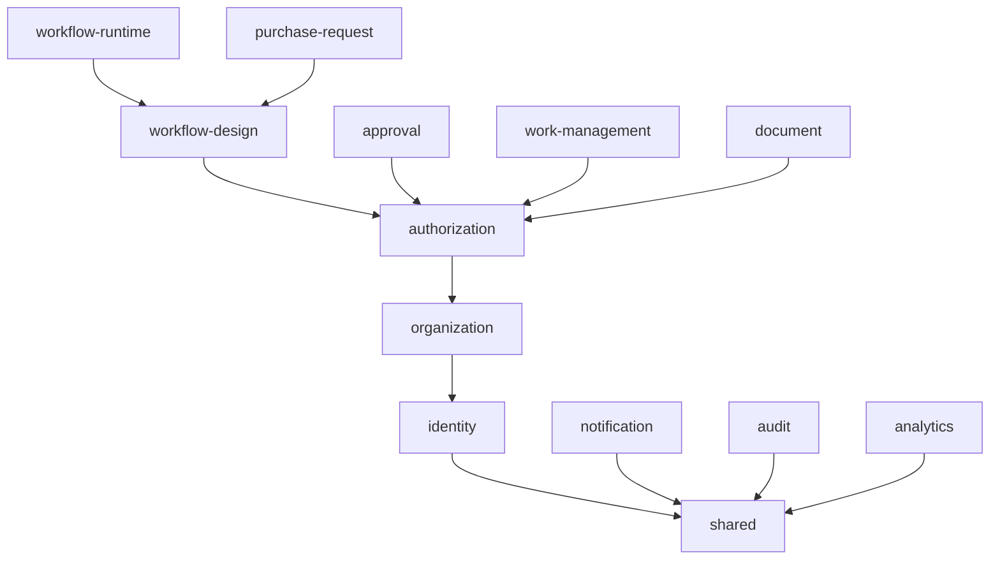

# Dependency Rules — Bağımlılık Kuralları ve Fitness Function'ları

Bağlayıcı kaynak: PRD §35.2, §35.3, §38, §39. İlgili ADR: ADR-001, ADR-003, ADR-008.

Bu kurallar **öneri değildir**. CI'da otomatik doğrulanır (bootstrap sonrası); ihlal eden PR merge edilemez.

---

## 1. Katman bağımlılığı

```
      presentation                infrastructure
   (FastAPI / Next.js)     (SQLAlchemy, S3, provider SDK)
            │                          │
            │  bağımlı                 │  IMPLEMENTE eder
            ▼                          ▼
       application  ────tanımlar───►  ports
            │
            │  bağımlı
            ▼
         domain          (hiçbir şeye bağımlı değil)
```

**Bağımlılık oku her zaman içe doğrudur.** Domain hiçbir dış katmanı bilmez.

| Katman | Bağımlı olabilir | Bağımlı OLAMAZ |
|---|---|---|
| `domain` | Yalnız standart kütüphane ve `shared` primitive'ler | FastAPI, SQLAlchemy, Pydantic, Next.js, herhangi bir provider SDK, başka modülün domain'i |
| `application` | Kendi domain'i, kendi port'ları, `shared` | Somut adapter, ORM modeli, HTTP framework |
| `infrastructure` | `application` port'ları, kendi domain'i, dış SDK'lar | Başka modülün domain veya persistence'ı |
| `presentation` | `application` (command/query) | Doğrudan repository, doğrudan domain mutasyonu |

### Yasak import örnekleri

```
modules/approval/domain/**        →  sqlalchemy            ❌
modules/approval/domain/**        →  fastapi               ❌
modules/approval/domain/**        →  pydantic              ❌  (DTO sınırında serbest)
modules/approval/**               →  modules/work_management/infrastructure/**  ❌
modules/notification/**           →  modules/approval/infrastructure/persistence/**  ❌
apps/web/**                       →  modules/**            ❌  (sözleşme üzerinden konuşur)
```

---

## 2. Modüller arası bağımlılık

**MUST NOT:**

1. Bir modül başka modülün **tablosuna yazamaz**.
2. Bir modül başka modülün **persistence modelini import edemez**.
3. Bir modülün domain'i başka modülün domain'ini import edemez.
4. İç domain event doğrudan modül sınırı dışına yayınlanamaz.

**MUST:**

- Cross-module **okuma** → sahibinin açık query contract'ı / read model'i.
- Cross-module **yazma** → sahibinin command API'si veya versiyonlu integration event.
- Integration event `tenant_id`, `correlation_id` ve versiyonlu `type` (`approval.decided.v1`) taşır.

### İzin verilen bağımlılık yönü (MVP)



- `workflow-runtime`, `approval` ve `work-management`'a **event/komut üzerinden** ulaşır — doğrudan import ile değil.
- `notification`, `audit` ve `analytics` **hiçbir iş modülünü import etmez**; yalnız event tüketir. Bu, onları ileride servis olarak ayırmayı mümkün kılar.
- `shared` paketi **hiçbir modüle bağımlı değildir**.

---

## 3. `shared` paketi kuralı

`shared` yalnızca şunları barındırır:

- Primitive value object'ler (`Money`, `TenantId`, `UserId`, `Ulid`)
- Error base sınıfları ve error catalog sözleşmesi
- `Clock` port'u
- `IdGenerator` port'u
- Telemetry (log/metric/trace) sözleşmeleri

**YASAK:** İş kuralı, entity, use case, repository, "yardımcı" fonksiyon çöplüğü. `shared` bir domain modülü değildir.

---

## 4. Port ve adapter

Dış dünyaya açılan her yetenek port arkasındadır:

| Port | Katman | MVP adapter'ı |
|---|---|---|
| `AuthProviderPort` | application | Fake adapter (gerçek provider **kararı açık** — ADR-005) |
| `WorkflowRuntimePort` | application | Custom PostgreSQL-backed runtime (**spike şartına bağlı** — ADR-004) |
| `FileStoragePort` | application | S3-compatible; local development MinIO adayı |
| `NotificationChannelPort` | application | In-app kanal |
| `ClockPort` | shared | System clock / fake clock |
| `IdGeneratorPort` | shared | ULID generator |

**Kurallar:**

- Provider SDK nesneleri adapter'ın **dışına çıkamaz** (anti-corruption layer).
- Fake adapter ve gerçek adapter **aynı contract test setini** geçer.
- Bir story yalnızca fake adapter'a karşı test edilerek "done" sayılamaz; gerçek boundary (DB, transaction, worker) en az bir integration testte doğrulanır.

---

## 5. Frontend bağımlılık kuralı

- `apps/web` backend modüllerini **import etmez**. Yalnız `packages/contracts` üzerinden konuşur.
- API tipleri OpenAPI'den **üretilir**; elle yazılmaz.
- Frontend'de business logic bulunamaz: yetki kararı, koşul değerlendirmesi, onay sırası, SLA hesabı **yalnız** backend'dedir.
- Onay/ret kararlarında optimistic UI YASAK; server-confirmed state gösterilir.

---

## 6. Fitness function'ları (CI'da otomatik)

Bootstrap (Epic E00) sonrasında CI aşağıdakileri doğrular. Herhangi biri kırmızıysa **merge yok**.

| # | Kontrol | Başarısızlık anlamı |
|---|---|---|
| FF-01 | `domain/**` içinde `sqlalchemy`, `fastapi`, provider SDK importu yok | Katman ihlali |
| FF-02 | Modül A'nın `infrastructure/persistence`'ı modül B tarafından import edilmiyor | Sahiplik ihlali |
| FF-03 | Tenant verisi taşıyan her tabloda `tenant_id` var (whitelist dışında) | Tenant izolasyon riski |
| FF-04 | Tenant verisi taşıyan her tabloda RLS politikası tanımlı | Tenant izolasyon riski |
| FF-05 | Mutasyona açık her aggregate'te optimistic concurrency alanı var | Yarış koşulu riski |
| FF-06 | Her public endpoint bir authorization policy adı belirtiyor | Yetkisiz erişim riski |
| FF-07 | Her background handler idempotency davranışını tanımlıyor | Duplicate side effect riski |
| FF-08 | Kod tabanında `eval(`/`exec(` yok | Kod çalıştırma açığı |
| FF-09 | Para alanlarında `float`/`double` yok | Yuvarlama hatası |
| FF-10 | Naive datetime yok; tüm timestamp'ler timezone-aware (UTC) | Zaman hatası |
| FF-11 | Published workflow tablolarına `UPDATE` çalıştıran kod yok | Immutability ihlali |
| FF-12 | `domain/**` içinde doğrudan sistem saati okuması yok (`Clock` kullanılıyor) | Test edilemezlik |
| FF-13 | Her dış HTTP çağrısında timeout ve bounded retry var | Sonsuz retry / kaynak tüketimi |
| FF-14 | Her yeni permission merkezi katalogda kayıtlı | Dağınık yetki modeli |
| FF-15 | Her liste endpoint'i cursor pagination + max page size kullanıyor | DoS riski |
| FF-16 | MVP node seti dışında node tipi tanımlı değil | Scope creep |

---

## 7. Dependency ekleme politikası

Yeni bir dependency ekleyen PR şunları belgelemek zorundadır (PRD §46.3):

- Kullanım gerekçesi (standart kütüphane veya mevcut dependency neden yetmiyor?)
- Lisans
- Bakım durumu (son release, açık kritik issue)
- Güvenlik durumu (bilinen CVE)
- Bundle/runtime etkisi
- Değerlendirilen alternatifler
- Kaldırma maliyeti (removal cost)

Agent, **dependency eklemeden önce** standart kütüphaneyi ve mevcut dependency'leri kontrol eder. Gerekçesiz dependency merge edilemez.
